# 算法流程详解

本文把 ASGARD 的 public API 到 Fortran 数值核的路径拆开说明。目标是让新手知道每个数组代表什么、在哪个坐标上离散、为什么某些步骤不能交换顺序，以及如何判断算法结果可信。


## 算法图示索引

下列示意图由 `tools/generate_doc_schematics.py` 使用 Python/matplotlib 生成，网页使用 PNG，`doc/assets/figures/algorithm/` 中同时保留可编辑 SVG、PDF 和 TIFF。图像强调算法数据流、离散变量和不可交换的步骤；具体实现细节仍以正文和源码为准。

| 算法环节 | 示意图 |
| --- | --- |
| Public API 到 solve state | 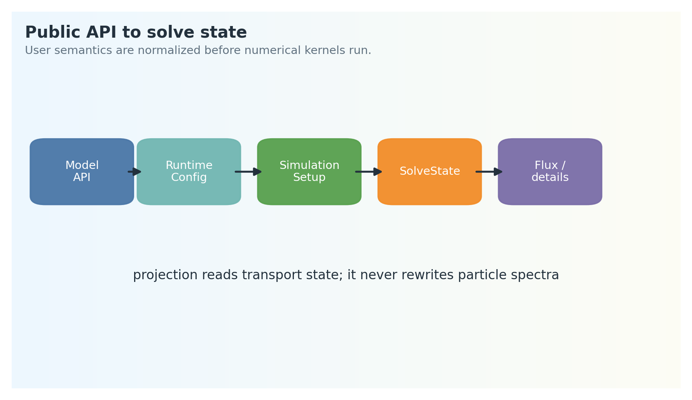{ width="320" } |
| log-grid 和 Jacobian | 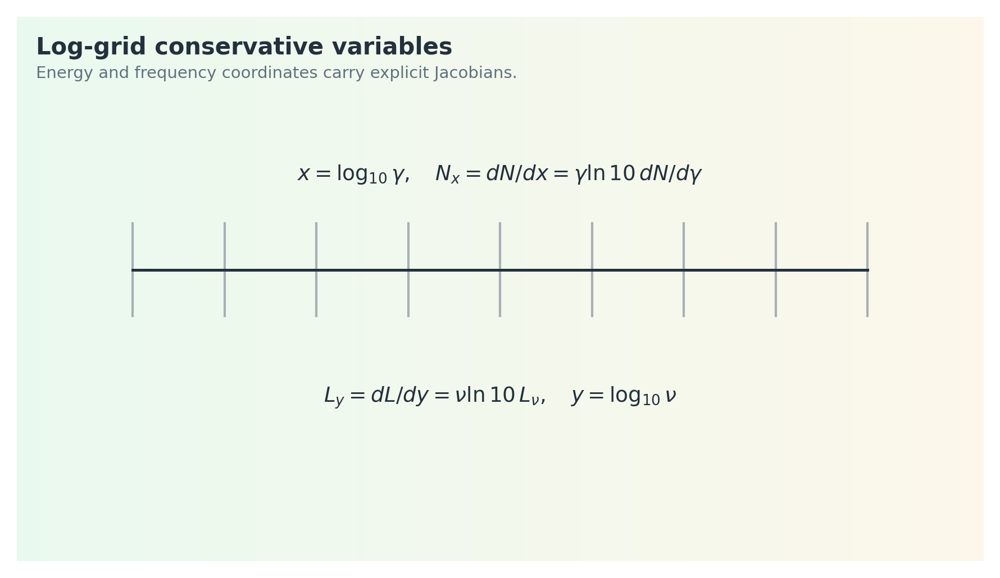{ width="320" } |
| 动力学 RK 更新和事件分段 | 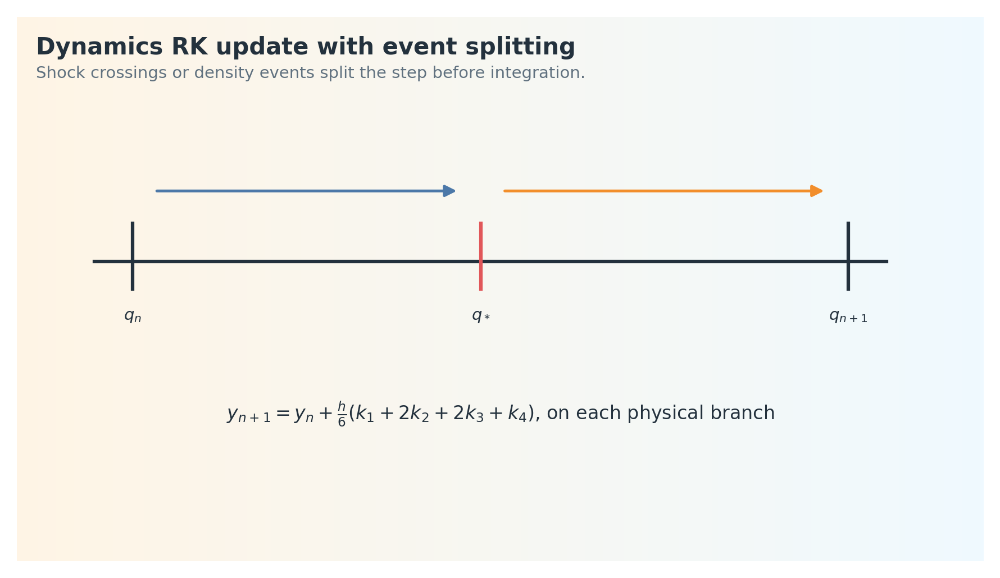{ width="320" } |
| `fullhide_1d` 有限体积电子更新 | 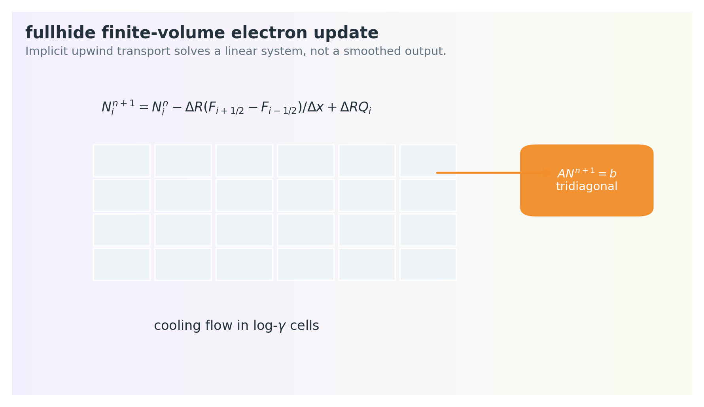{ width="320" } |
| 子步和自适应误差控制 | 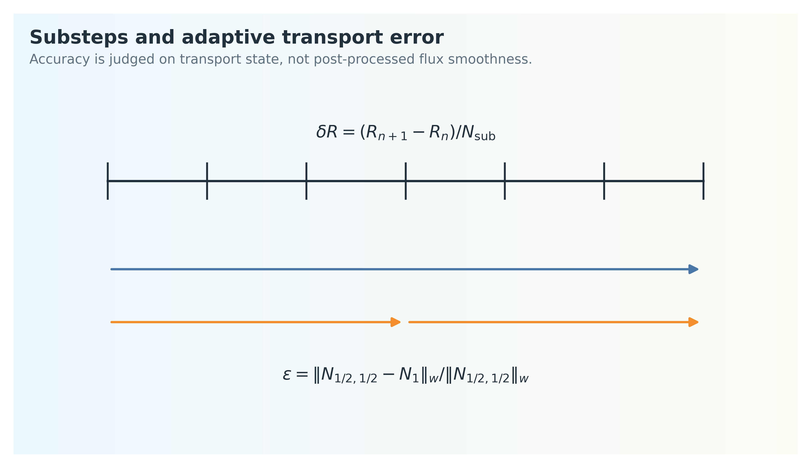{ width="320" } |
| `PhotonFieldState` 构建 | 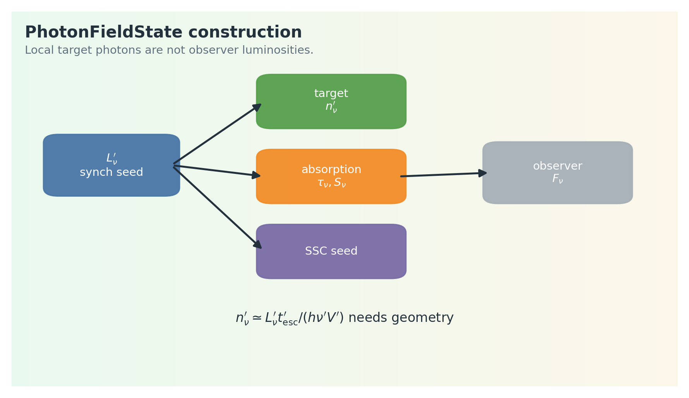{ width="320" } |
| SSC 谱和 IC cooling 顺序 | 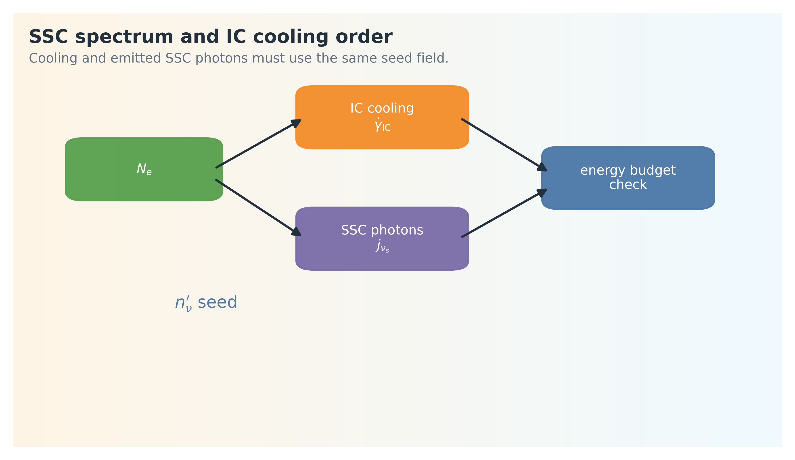{ width="320" } |
| 强子 transport 算法 | 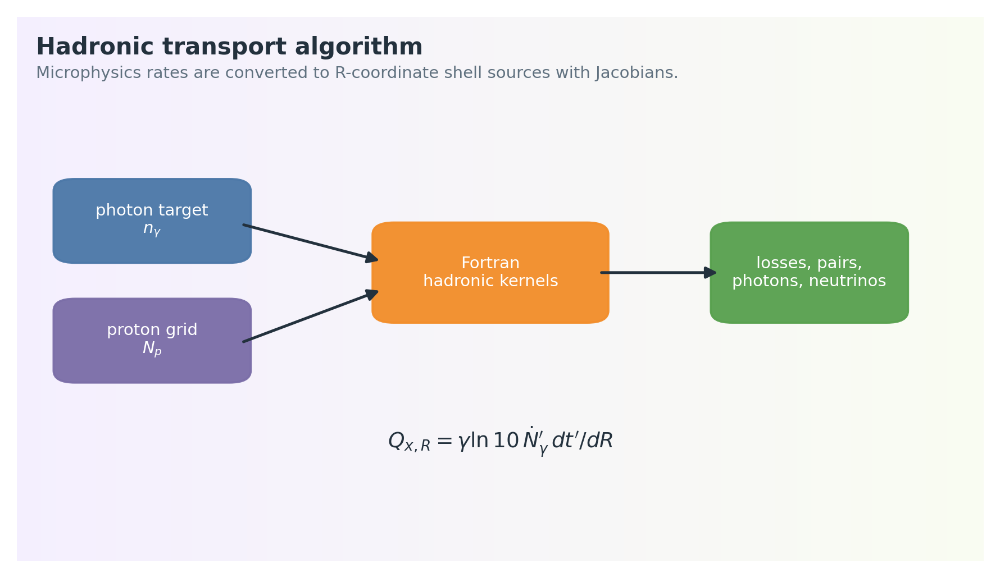{ width="320" } |
| joint feedback 固定点迭代 | 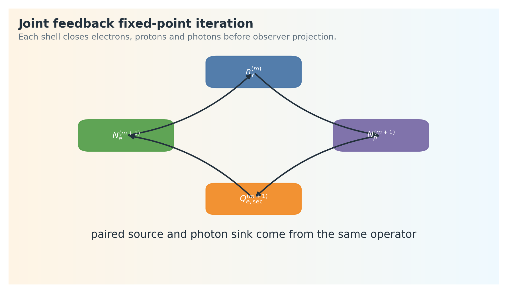{ width="320" } |
| pair-cascade shell sequence | 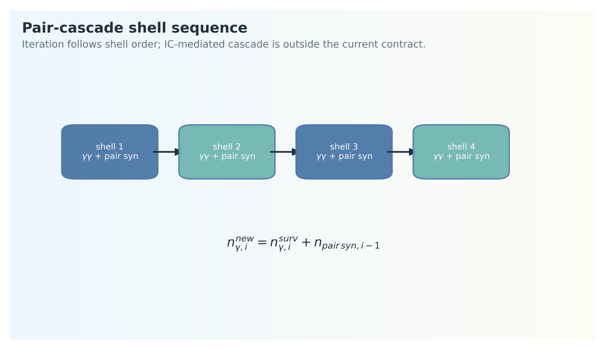{ width="320" } |
| EATS 插值 | 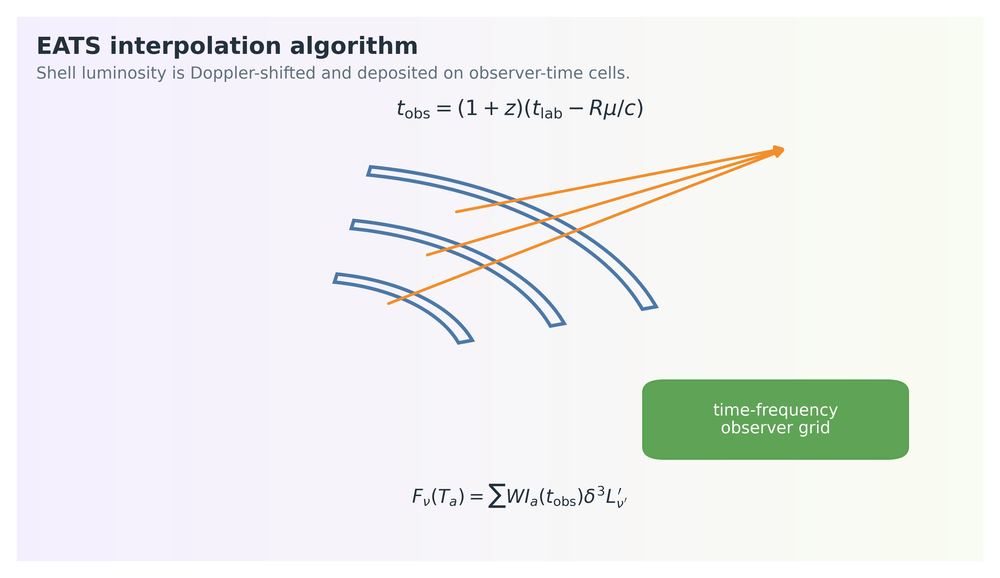{ width="320" } |
| \(\chi\)-resolved 投影重映射 | 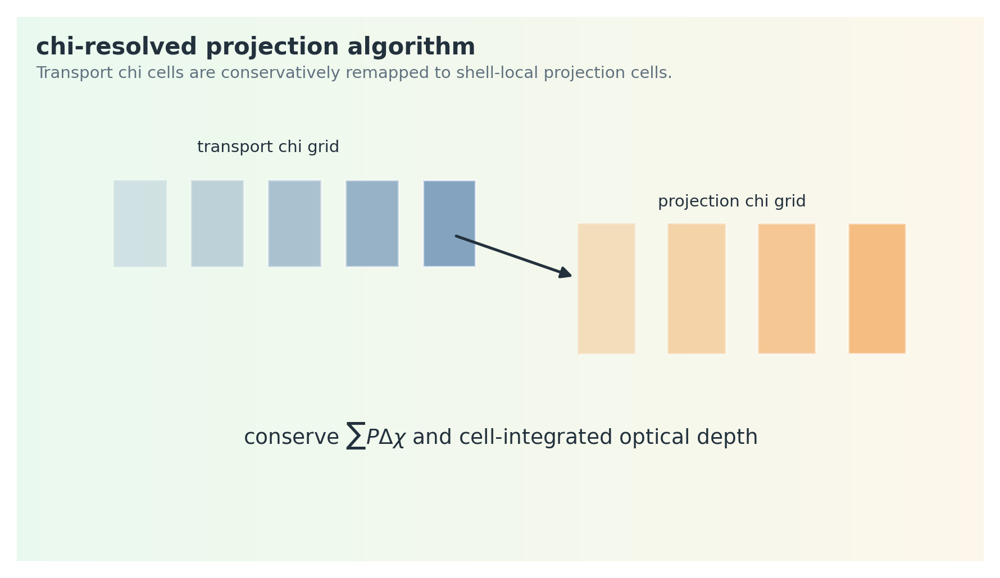{ width="320" } |
| 结构化 patch、cache 和验证 | 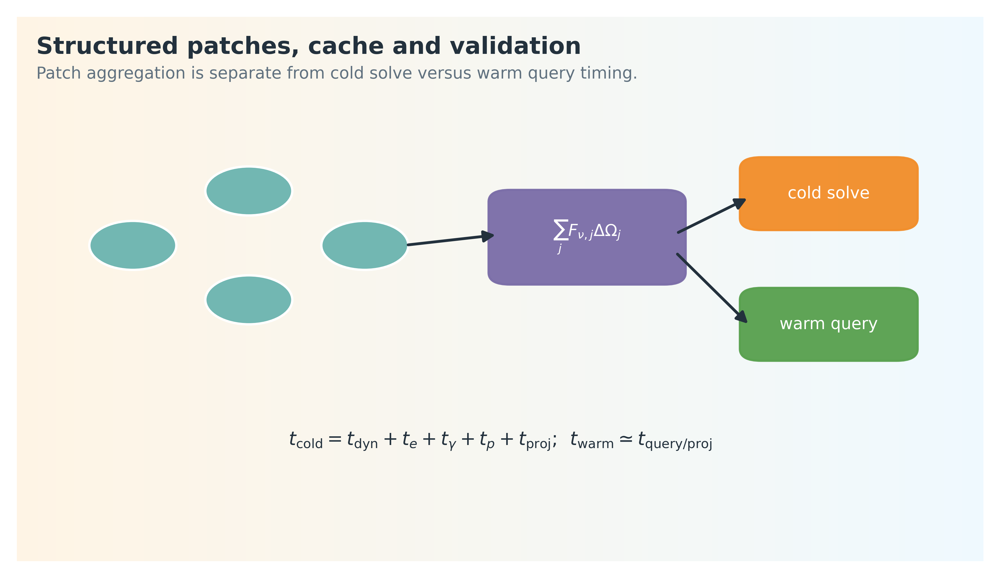{ width="320" } |

## 1. 从用户输入到求解状态

典型入口是

```python
result = model.flux_density_grid(times_s, nu_hz)
```

内部路径是

```text
Model
-> RuntimeConfig
-> SimulationSetup
-> solve_state_from_setup
-> SolveState
-> project_flux_grid
-> FluxResult
```

`Model` 保存用户语义，`RuntimeConfig` 保存已归一化参数，`SimulationSetup` 保存边界向量和网格，`SolveState` 保存动力学、粒子、光子、强子和观测投影前的完整状态。

算法上最重要的规则是：transport state 只由上游物理阶段写入；observer projection 只读 transport state，不回写粒子谱或 photon field。

## 2. 网格和数组方向

主要数组维度如下：

| 数组 | 典型形状 | 含义 |
| --- | --- | --- |
| `R` | `(Num_R,)` | shock radius shell grid |
| `R_Gamma` | `(Num_R,)` | bulk Lorentz factor |
| `R_Tobs` | `(Num_R,)` | on-axis observer-time mapping |
| `gam_e` | `(Num_gam_e,)` | electron Lorentz-factor grid |
| `dN_gam_e` | `(Num_gam_e, Num_R)` | electron spectrum |
| `V_seed` | `(Num_nu,)` | photon frequency grid |
| `P_syn` | `(Num_nu, Num_R)` | shell synchrotron power |
| `gam_p` | `(Num_gam_p,)` | proton Lorentz-factor grid |
| `chi_grid` | `(Num_chi,)` | 2D q-mass downstream coordinate reported as its BM-equivalent chi value |

2D transport 的真实厚壳坐标是 `q_grid/q_face/dq`。`chi_grid` 只把每个 \(q\) cell 映射成 BM 等效 \(\chi\) 诊断值；`chi_eats_2d` 投影实际读取 `chi_radius_cm`、`chi_gamma_bulk` 和 `chi_dvolume_weight`。

电子和质子通常在 log grid 上离散：

\[
x_i
=
\log_{10}\gamma_i,
\qquad
\Delta x
=
x_{i+1}-x_i .
\]

若连续谱是 \(N_\gamma=\mathrm{d}N/\mathrm{d}\gamma\)，代码中常用的 log-grid 保守变量是

\[
N_x
=
\frac{\mathrm{d}N}{\mathrm{d}x}
=
\gamma\ln 10
\frac{\mathrm{d}N}{\mathrm{d}\gamma}.
\]

因此积分电子数应写成

\[
N_{\rm tot}
=
\int N_x\,\mathrm{d}x
\simeq
\sum_i N_{x,i}\Delta x .
\]

这就是为什么 transport update 不能随意在 \(N_\gamma\) 和 \(N_x\) 之间省略 Jacobian。

## 3. 动力学离散

`Dynamics_forward.f90` 按 observer-time 相关网格推进壳层状态。概念上，动力学 ODE 写作

\[
\frac{\mathrm{d}\mathbf{y}}{\mathrm{d}T}
=
\mathbf{f}(T,\mathbf{y};\mathbf{p}),
\]

其中

\[
\mathbf{y}
=
(\Gamma,M_{\rm sw},U,R,\ldots).
\]

在 log-time refinement 中，实际推进变量满足

\[
\frac{\mathrm{d}\mathbf{y}}{\mathrm{d}\ln T}
=
T
\frac{\mathrm{d}\mathbf{y}}{\mathrm{d}T}.
\]

RK4 的一步可写作

\[
\mathbf{y}_{n+1}
=
\mathbf{y}_n
+
\frac{h}{6}
\left(
\mathbf{k}_1
+2\mathbf{k}_2
+2\mathbf{k}_3
+\mathbf{k}_4
\right),
\]

\[
\mathbf{k}_1=\mathbf{f}(T_n,\mathbf{y}_n),
\quad
\mathbf{k}_2=\mathbf{f}\left(T_n+\frac{h}{2},\mathbf{y}_n+\frac{h\mathbf{k}_1}{2}\right),
\]

\[
\mathbf{k}_3=\mathbf{f}\left(T_n+\frac{h}{2},\mathbf{y}_n+\frac{h\mathbf{k}_2}{2}\right),
\quad
\mathbf{k}_4=\mathbf{f}(T_n+h,\mathbf{y}_n+h\mathbf{k}_3).
\]

输出的 \((R_i,\Gamma_i,M_i,t_{{\rm obs},i})\) 是所有下游粒子和辐射阶段的壳层骨架。若动力学不平滑，下游没有任何算法可以物理地修复它。

## 4. `fullhide_1d` 电子输运

`fullhide_1d` 的核心 PDE 是

\[
\frac{\partial N_x}{\partial R}
+
\frac{\partial}{\partial x}
\left(
v_x N_x
\right)
=
Q_x,
\]

其中

\[
v_x
=
\frac{\mathrm{d}x}{\mathrm{d}R}
=
\frac{1}{\gamma\ln10}
\frac{\mathrm{d}\gamma}{\mathrm{d}R}.
\]

有限体积离散后，一个 cell 的更新为

\[
N_{x,i}^{n+1}
=
N_{x,i}^{n}
-
\frac{\Delta R}{\Delta x}
\left(
F_{i+1/2}^{n+1}
-
F_{i-1/2}^{n+1}
\right)
+
\Delta R\,Q_{x,i}.
\]

`fullhide` 使用隐式迎风思想处理 stiff cooling。若 \(v_{i+1/2}<0\)，电子向低能方向冷却，通量主要由高能侧 cell 决定：

\[
F_{i+1/2}
=
v_{i+1/2}N_{x,i+1}.
\]

这会形成三对角或近三对角线性系统：

\[
\mathbf{A}\mathbf{N}^{n+1}
=
\mathbf{b}.
\]

隐式格式的意义是允许同步/IC 冷却时间短于 shell step 时仍保持谱形稳定。它不是 smoothing；它是在 transport 方程层面求解 stiff advection。

## 5. 子步和误差控制

固定子步模式把一个壳层间隔 \(\Delta R_i=R_i-R_{i-1}\) 分成 \(L_i\) 个小步。自适应模式用一次 full step 和两次 half step 比较误差，决定后续 \(\Delta R\) 是否缩小或放大。详细误差公式见 `doc/shock_shell_adaptive_algorithms.md`；验收不是看每一步误差打印，而是看最终 \(N_e(\gamma,R)\)、特征频率和光变是否平滑且守恒预算合理。

## 6. 注入源项离散

每个 shell step 的注入数来自 swept-up electrons：

\[
\Delta N_{\rm inj}
=
\xi_N
\Delta N_{\rm sw}.
\]

离散谱源项满足

\[
\sum_i Q_{x,i}\Delta x
=
\Delta N_{\rm inj}.
\]

能量预算满足

\[
\sum_i
(\gamma_i-1)m_ec^2
Q_{x,i}
\Delta x
=
\epsilon_e \Delta E_{\rm sh}.
\]

如果 thermal electrons 开启，非热与热电子共用同一个 shell electron budget：

\[
\Delta N_{\rm th}
=
(1-\xi_N)\Delta N_{\rm sw},
\qquad
\Delta N_{\rm nth}
=
\xi_N\Delta N_{\rm sw}.
\]

这类归一化必须在进入 transport 前完成，不能在输出谱后用比例因子补救。

## 7. 冷却项组装

电子 cooling kernel 先计算每个能量 face 的冷却速度，再组装 transport 系数。总 face speed 可抽象为

\[
v_{i+1/2}
=
v_{{\rm ad},i+1/2}
+
v_{{\rm syn},i+1/2}
+
v_{{\rm IC},i+1/2}
+
v_{{\rm SSA},i+1/2}.
\]

同步冷却项随 \(\gamma^2B'^2\) 增长，高能端最 stiff。IC 冷却依赖 photon seed：

\[
v_{\rm IC}
=
v_{\rm IC}
\left[
N_e,\ n_\gamma,\ B',\ R,\ \Gamma
\right].
\]

因此 `ssc_cooling=True` 会改变电子谱，不能只理解为“多输出一个 SSC 分量”。

## 8. 同步辐射积分算法

给定 \(N_e(\gamma_i)\) 后，shell synchrotron power 的离散积分为

\[
L'_{\nu_j}
\simeq
\sum_i
N_{\gamma,i}
P'_{\nu_j}(\gamma_i)
\Delta\gamma_i .
\]

在 log grid 中可写成

\[
L'_{\nu_j}
\simeq
\sum_i
N_{x,i}
P'_{\nu_j}(\gamma_i)
\Delta x .
\]

`index_syn_integr=1/2` 是固定网格快速路径。adaptive integration 是诊断路径，不能作为默认拟合算法随意打开。若固定网格和 adaptive 路径差异大，优先检查频率范围、电子网格和 kernel 分辨率。

SSA optical depth 的离散形式为

\[
\tau_{\nu_j}
=
\alpha_{\nu_j}\ell',
\]

其中 \(\ell'\) 来自 shell geometry。频率 cell 间的 \(\tau_\nu\) 应平滑；锯齿通常说明 SSA root、频率网格或电子谱导数有问题。

## 9. PhotonFieldState 构建

`_build_photon_field_stage` 从电子辐射输出构建多个 seed：

```text
forward_syn_seed
hadronic_forward_ssc_seed
hadronic_target_seed
absorption_syn_seed
absorption_ssc_seed
```

算法上要保持两种单位映射：

\[
L_\nu
\rightarrow
u_\nu
\rightarrow
n_\epsilon ,
\]

以及

\[
\nu
\leftrightarrow
\epsilon=h\nu .
\]

每次从 per-Hz 量转换到 per-energy 量都要保留 Jacobian：

\[
n_\epsilon
=
n_\nu
\frac{\mathrm{d}\nu}{\mathrm{d}\epsilon}
=
\frac{n_\nu}{h}.
\]

Hadronic 和 absorption kernel 不能混用未注明单位的 seed arrays。

## 10. SSC 谱和 IC cooling 的顺序

Separated path 的典型顺序是：

```text
electron solve
-> synchrotron seed
-> SSC photon spectrum
-> hadronic / absorption consumers
```

Joint path 中，IC cooling 和 photon source 必须在同一个 iteration 中使用同一个 seed。概念上第 \(m\) 次迭代为

\[
N_e^{(m)}
\rightarrow
n_\gamma^{(m)}
\rightarrow
\left(
\dot{\gamma}_{\rm IC}^{(m)},
Q_{\gamma,{\rm SSC}}^{(m)}
\right)
\rightarrow
N_e^{(m+1)}.
\]

若只更新 \(\dot{\gamma}_{\rm IC}\) 而不更新 \(Q_{\gamma,{\rm SSC}}\)，电子能量损失和 photon output 的预算会不闭合。

## 11. 强子 transport 算法

Formal hadronic path 在每个 shell 上推进 proton spectrum：

\[
\frac{\partial N_p}{\partial t'}
+
\frac{\partial}{\partial E_p}
\left(
\dot{E}_p N_p
\right)
=
Q_p
+
Q_{p,{\rm reinj}}
-
\frac{N_p}{t_{\rm esc}}.
\]

离散到 \(R\) 坐标：

\[
\Delta t'_i
=
\frac{\Delta R_i}{\beta_i\Gamma_i c}.
\]

每个 microphysics operator 返回的 \({\rm s}^{-1}\) rate 都必须乘以 \(\Delta t'_i\) 或 \(\mathrm{d}t'/\mathrm{d}R\) 后才能进入 shell update。

Hadronic stage 组合的 operator 包括：

```text
proton injection / acceleration
proton synchrotron
p-gamma
Bethe-Heitler
pp
secondary species transport
secondary radiation
gamma-gamma pair branch
neutrino output
```

每个 operator 的输出必须清楚标注是 loss rate、source rate、luminosity 还是 observer component。

## 12. Secondary feedback 拼装

Joint feedback 需要把 hadronic 与 pair 过程输出的二级 \(e^\pm\) 转成电子方程源项：

\[
Q_{e,{\rm secondary},R}
=
\frac{\mathrm{d}t'}{\mathrm{d}R}
\left(
Q_{e,{\rm BH}}
+
Q_{e,pp}
+
Q_{e,\gamma\gamma}
\right).
\]

Photon sink 也要在同一 shell 上更新：

\[
n_{\gamma}^{\rm next}(\epsilon)
=
n_{\gamma}^{\rm src}(\epsilon)
\exp[-\tau(\epsilon)]
+
n_{\gamma}^{\rm add}(\epsilon).
\]

这里的表达只说明 source/sink 结构；实际实现必须保持 `PhotonFieldState` 字段语义不变。不能因为某个 sink 缺失就用经验衰减因子补齐。

## 13. Pair cascade 迭代

Pair/synch cascade 可以写成序列：

\[
n_\gamma^{(m)}
\xrightarrow{\gamma\gamma}
Q_{e^\pm}^{(m)}
\xrightarrow{\rm synch}
n_{\gamma,{\rm pair}}^{(m)}
\xrightarrow{\rm add}
n_\gamma^{(m+1)}.
\]

当前 `pair_cascade_iterations` 控制的是 gamma-gamma pair/synch cascade。若要扩展 IC-mediated cascade，还需要加入

\[
Q_{e^\pm}^{(m)}
\xrightarrow{\rm IC}
n_{\gamma,{\rm IC}}^{(m)}
\xrightarrow{\gamma\gamma}
Q_{e^\pm}^{(m+1)}.
\]

这个闭环当前不属于实现边界，因此文档和示例不能把它描述为已支持。

## 14. EATS 插值算法

本地 shell luminosity 投影到观测者时间时，先计算角向 arrival time：

\[
t_{\rm obs}(R,\mu)
=
t_{\rm obs,axis}(R)
+
(1+z)\frac{R(1-\mu)}{c}.
\]

对每个观测时间 \(T_k\)，算法找到满足

\[
t_{\rm obs}(R_i,\mu)
\le
T_k
<
t_{\rm obs}(R_{i+1},\mu)
\]

的 shell 区间，并做时间方向线性插值：

\[
q(T_k)
=
(1-a)q_i+aq_{i+1},
\qquad
a=
\frac{T_k-t_i}{t_{i+1}-t_i}.
\]

频率方向在 log SED 上插值：

\[
\log F_\nu(\nu)
=
(1-b)\log F_{\nu_j}
+
b\log F_{\nu_{j+1}}.
\]

这能保持跨数量级谱的相对平滑。若某个 shell 的本地谱为非正值，该频率点不会被强行取 log 修补；应检查上游辐射输出。

## 15. Doppler 和红移处理

代码中投影使用

\[
D
=
\Gamma(1-\beta\mu)
=
\delta^{-1}.
\]

频率映射为

\[
\nu'
=
(1+z)D\nu_{\rm obs}.
\]

强度权重使用

\[
F_{\nu_{\rm obs}}
\propto
D^{-3}
L'_{\nu'}
\frac{\Delta\Omega}{4\pi}.
\]

因此读 `SED_interpolation.f90` 时，变量名 `doppler` 对应的是 \(D\)，不是常见记号 \(\delta\)。这是文档中特别需要说明的实现细节。

## 16. \(\chi\)-resolved 投影算法

`sed_interpolation_chi` 在普通角向等到达时间面外再加一个厚度维：

```text
theta / phi angle cell
-> chi cell
-> shell interval
-> observer time-frequency grid
```

对每个 \((R_i,\chi_k)\)，算法使用局域 \(R_{\chi,k,i}\)、\(\Gamma_{\chi,k,i}\)、\(W_{\chi,k,i}\) 和 \(\tau_{\nu,k,i}\)。cell optical-depth prefix、cell-averaged SSA escape、\(D^{-3}\) 权重和薄壳极限公式见 `doc/shock_shell_adaptive_algorithms.md`。薄壳极限下 `sed_interpolation_chi` 应回到壳层级等到达时间面。

## 17. 结构化喷流 patch 聚合

结构化喷流把角向 profile 离散为 patches：

\[
E_{\rm iso}
=
E_{\rm iso}(\theta,\phi),
\qquad
\Gamma_0
=
\Gamma_0(\theta,\phi).
\]

每个 patch 独立计算局域 solve 或投影贡献，最后求和：

\[
F_\nu^{\rm total}
=
\sum_j
F_{\nu,j}
\Delta\Omega_j .
\]

如果只改变 observer angle 而底层 solve state 不变，benchmark 可以复用 solve state，只重跑 projection。但这只适用于已证明物理配置、网格、频率和时间数组相同的情况。

## 18. CPU fullhide 波前并行路线

CPU 版本的 `fullhide` 优化目标是保持同一物理离散和代数依赖，而不是照搬 GPU 的执行形状。GPU 适合 cell-level anti-diagonal wavefront；CPU 若直接对单个 `(gamma, substep)` cell 做每条反对角 OpenMP 同步，在 `num_electron_gamma` 约为 96 到 201 的典型网格上并行宽度太小，同步成本会吞掉收益。

当前可接受的 CPU 路线有三类，均必须保持 fullhide spacetime stencil 的因果依赖：

| 路线 | 并行粒度 | 适用目标 | 验收 |
| --- | --- | --- | --- |
| 多 shell / 多 patch 合并波前 | 同一 wave 上并行多个 `(sample, patch, shell, gamma)` work item。 | 生产网格、结构化喷流、批量拟合。 | work item 的冷却、注入和边界状态必须预先完成；不得跨物理依赖乱序。 |
| tile-wavefront | 把 `(gamma, substep)` 平面切成 tile，tile 内串行，tile 间反对角并行。 | 单 shell 或中等 batch 的 CPU cache 友好求解。 | tile 结果必须与 step-major 标量基线在 roundoff 内一致。 |
| OpenMP task depend | 用 task dependency 表达 tile 依赖，避免每条 wave 全局 barrier。 | 不规则 substep、wind/jump 介质和流水调度。 | 先做独立 Fortran probe，再接入 transport common；依赖 token 必须对应真实边界数据。 |

不应接受的路线包括：

- 直接照搬 GPU cell-level anti-diagonal OpenMP `parallel do`。
- 只在 smoke 网格上证明加速。
- 用 smoothing、截断或经验因子修正不平滑输出。
- 为避免退化添加隐藏 fallback。

生产验收应报告 `num_radius`、`num_theta`、`num_phi`、`num_electron_gamma`、`num_photon_frequency`、`num_observer_time`、线程数、electron stage wall time、total wall time 和抽样光变平滑性。若某介质或线程数不快，应报告结果并重新设计并行粒度，而不是在 runtime 中静默切换算法。

## 19. Fitter 的算法含义

`Fitter` 不改变物理求解。它做三件事：

1. 把采样变量写入 `Model` 字段。
2. 调用同一个 `flux_density` / `flux_density_grid`。
3. 计算 likelihood。

当前高斯 likelihood 为

\[
\ln\mathcal{L}
=
-\frac{1}{2}
\sum_i
\left[
\frac{F_i^{\rm model}-F_i^{\rm obs}}{\sigma_i}
\right]^2 .
\]

参数变换由 `Param` 负责：

\[
\theta_{\rm physical}
=
\begin{cases}
10^x, & {\rm Scale.LOG10},\\
x, & {\rm Scale.LINEAR},\\
\theta_{\rm fixed}, & {\rm Scale.FIXED}.
\end{cases}
\]

因此 MCMC 的异常 posterior 通常来自模型、数据选择、单位或参数边界，而不是一个独立的“拟合物理”。

## 20. 缓存、cold solve 和 warm query

`Model` 会缓存相同时间/频率/projection query 的 raw solve。算法报告必须区分：

\[
t_{\rm cold}
=
t_{\rm dynamics}
+t_{\rm electron}
+t_{\rm radiation}
+t_{\rm projection},
\]

\[
t_{\rm warm}
\approx
t_{\rm cached\ projection/query}.
\]

把 warm query 当成 full model evaluation 会高估拟合速度。benchmark 文档必须说明是否已有 cache。

## 21. 公式级算法设计细节

本节把主链中最容易被误改的算法写成离散公式。公式中的 \(n\) 表示半径 shell index，\(i\) 表示能量或频率 cell index，\(j\) 表示角向 patch index。

### Public API 归一化

用户输入首先被归一化为 `RuntimeConfig`。概念上这是一个纯映射

\[
\mathcal{C}
=
\mathcal{N}
\left(
\mathcal{J},
\mathcal{M},
\mathcal{O},
\mathcal{R},
\mathcal{S}
\right),
\]

其中 \(\mathcal{J}\) 是 jet，\(\mathcal{M}\) 是 medium，\(\mathcal{O}\) 是 observer，\(\mathcal{R}\) 是 radiation，\(\mathcal{S}\) 是 solver/numerics。归一化只做单位和字段语义转换，例如

\[
t_{\min,\log}= \log_{10}(t_{\min}/{\rm s}),
\qquad
t_{\max,\log}= \log_{10}(t_{\max}/{\rm s}),
\]

\[
{\tt index\_y}
=
\begin{cases}
0,&{\tt ssc\_cooling\_mode="none"},\\
1,&{\tt ssc\_cooling\_mode="numeric\_ic\_kn"},\\
2,&{\tt ssc\_cooling\_mode="nakar\_y\_thomson"}.
\end{cases}
\]

三个取值对应的是电子冷却方程的不同写法，而不是 SSC 光子输出开关。`none` 只保留同步冷却和 SSA 项。`numeric_ic_kn` 用当前 seed photon field 对 IC/SSC 冷却损失做数值积分，积分核包含 Jones/Klein-Nishina 截面约束；在冷却率中表现为

\[
\frac{\mathrm{d}\gamma}{\mathrm{d}R}
\supset
\dot{\gamma}_{\rm syn}
+
\dot{\gamma}_{\rm IC}^{\rm KN}[n_\gamma(\nu)].
\]

`nakar_y_thomson` 不逐频率积分 KN 损失，而是按 Nakar 型 Compton \(Y\) 参数近似，把同步冷却放大为

\[
\dot{\gamma}_{\rm syn+IC}
=
(1+Y_{\rm Nakar})\dot{\gamma}_{\rm syn}.
\]

因此 `numeric_ic_kn` 适合 joint feedback 和需要能量预算闭合的情形；`nakar_y_thomson` 适合普通 forward-shock SSC cooling 的快速近似。

这个阶段不运行物理求解，也不根据失败结果重写用户参数。

### Log grid 和 cell Jacobian

电子、质子和 photon grid 常用 log 坐标：

\[
x=\log_{10}\gamma,
\qquad
y=\log_{10}\nu.
\]

若物理谱为 \(N_\gamma=\mathrm{d}N/\mathrm{d}\gamma\)，保守变量是

\[
N_x
=
\frac{\mathrm{d}N}{\mathrm{d}x}
=
\gamma\ln 10\,N_\gamma.
\]

若 photon luminosity 使用 log-frequency cell 存储，

\[
L_y
=
\frac{\mathrm{d}L}{\mathrm{d}y}
=
\nu\ln10\,L_\nu.
\]

任意从 per-frequency 到 per-log-frequency 的转换都必须显式乘以 \(\nu\ln10\)，反向转换必须除以同一 Jacobian。省略这个因子会让能量预算随网格分辨率漂移。

### 动力学 RK 更新和事件边界

动力学 ODE 写作

\[
\frac{\mathrm{d}\mathbf{y}}{\mathrm{d}q}
=
\mathbf{F}(q,\mathbf{y}),
\qquad
q=\ln T \ \text{or}\ R .
\]

四阶 Runge-Kutta 更新为

\[
\mathbf{y}_{n+1}
=
\mathbf{y}_n
+
\frac{\Delta q}{6}
\left(
\mathbf{k}_1+2\mathbf{k}_2+2\mathbf{k}_3+\mathbf{k}_4
\right),
\]

\[
\mathbf{k}_1=\mathbf{F}(q_n,\mathbf{y}_n),
\quad
\mathbf{k}_2=\mathbf{F}\left(q_n+\frac{\Delta q}{2},\mathbf{y}_n+\frac{\Delta q}{2}\mathbf{k}_1\right),
\]

\[
\mathbf{k}_3=\mathbf{F}\left(q_n+\frac{\Delta q}{2},\mathbf{y}_n+\frac{\Delta q}{2}\mathbf{k}_2\right),
\quad
\mathbf{k}_4=\mathbf{F}(q_n+\Delta q,\mathbf{y}_n+\Delta q\,\mathbf{k}_3).
\]

若存在 shock crossing、density jump 或 injection break，step 不能跨越物理分支后再用插值修补。算法上应先分段：

\[
[q_n,q_{n+1}]
=
[q_n,q_\ast]\cup[q_\ast,q_{n+1}],
\]

分别在每个物理右端项上推进。这样保证不连续只来自真实边界条件，而不是 RK step 混合两个方程。

### 电子有限体积更新

在 log-gamma 坐标 \(x\) 上，电子输运为

\[
\frac{\partial N_x}{\partial R}
+
\frac{\partial}{\partial x}
\left(v_xN_x\right)
=
Q_x,
\qquad
v_x
=
\frac{1}{\gamma\ln10}
\frac{\mathrm{d}\gamma}{\mathrm{d}R}.
\]

cell average 记为

\[
\bar{N}_{i}^{n}
=
\frac{1}{\Delta x_i}
\int_{x_{i-1/2}}^{x_{i+1/2}}
N_x(x,R_n)\,\mathrm{d}x.
\]

有限体积更新为

\[
\bar{N}_{i}^{n+1}
=
\bar{N}_{i}^{n}
-
\frac{\Delta R_n}{\Delta x_i}
\left(
F_{i+1/2}^{n+\theta}
-
F_{i-1/2}^{n+\theta}
\right)
+
\Delta R_n\,Q_i^{n+\theta}.
\]

其中 \(\theta=1\) 对应隐式更新。冷却主导时 \(v_{i+1/2}<0\)，迎风通量取高能侧：

\[
F_{i+1/2}
=
v_{i+1/2}\bar{N}_{i+1}.
\]

对所有 cell 写成矩阵形式：

\[
a_i\bar{N}_{i-1}^{n+1}
+
b_i\bar{N}_{i}^{n+1}
+
c_i\bar{N}_{i+1}^{n+1}
=
d_i .
\]

`fullhide_1d` 的稳定性来自求解这个输运线性系统，而不是对输出谱做平滑。若 \(Q_i\)、\(v_i\) 或边界 flux 不连续，隐式求解只会忠实传播错误。

### 子步合并和自适应误差

固定子步把 shell interval 分成

\[
\delta R=\frac{R_{n+1}-R_n}{N_{\rm sub}}.
\]

若某些系数在子步内可由同一物理状态一致积分，可把源项积分写成

\[
\mathcal{Q}_i
=
\int_{R_n}^{R_{n+1}}
Q_i(R)\,\mathrm{d}R
\simeq
\sum_{\ell=1}^{N_{\rm sub}}
Q_{i,\ell}\delta R_\ell .
\]

合并子步只在保持同一 flux-split 和边界位移的情况下成立。不能把多个子步简单平均成一个冷却率后忽略电子沿 \(\gamma\) 方向的位移。

自适应误差使用 full step 和 two half steps：

\[
\epsilon
=
\frac{
\left\|
\mathbf{N}_{1/2,1/2}
-
\mathbf{N}_{1}
\right\|_w
}{
\left\|
\mathbf{N}_{1/2,1/2}
\right\|_w
}.
\]

只有当该误差度量对应 transport state 本身，而不是 observer flux 的后验光滑性，才是有效子步控制。

### Photon field 构建

壳层同步 luminosity 到 photon number density 的抽象转换为

\[
n'_\nu
\simeq
\frac{L'_\nu t'_{\rm esc}}
{h\nu'V'},
\qquad
t'_{\rm esc}\sim\frac{\ell'}{c}.
\]

算法上需要显式定义 \(V'\)、escape time 和频率 Jacobian。`PhotonFieldState` 中的 target seed、absorption seed 和 SSC seed 可以来自同一同步谱，但用途不同：

\[
\{L'_\nu\}
\xrightarrow{\rm geometry}
\{n'_\nu\}_{\rm target},
\qquad
\{L'_\nu\}
\xrightarrow{\rm transfer}
\{\tau_\nu,S_\nu\}_{\rm absorption}.
\]

observer luminosity \(F_\nu\) 不能反向当作本地 \(n'_\nu\)，因为前者已经包含 Doppler、redshift、EATS 和距离稀释。

### Joint feedback 固定点迭代

joint shell stage 可以写作固定点问题：

\[
\mathbf{N}_e
=
\mathcal{E}
\left[
\mathbf{Q}_{e,\rm prim}
+
\mathbf{Q}_{e,\rm sec}(\mathbf{N}_p,\mathbf{n}_\gamma),
\mathbf{n}_\gamma
\right],
\]

\[
\mathbf{N}_p
=
\mathcal{H}
\left[
\mathbf{Q}_{p},
\mathbf{n}_\gamma
\right],
\]

\[
\mathbf{n}_\gamma
=
\mathcal{P}
\left[
\mathbf{N}_e,\mathbf{N}_p
\right].
\]

其中 \(\mathcal{E}\) 是电子输运算子，\(\mathcal{H}\) 是 formal hadronic transport，\(\mathcal{P}\) 是 photon field rebuild。一次迭代为

\[
\mathbf{n}_\gamma^{(m)}
\rightarrow
\mathbf{N}_p^{(m+1)}
\rightarrow
\mathbf{Q}_{e,\rm sec}^{(m+1)}
\rightarrow
\mathbf{N}_e^{(m+1)}
\rightarrow
\mathbf{n}_\gamma^{(m+1)}.
\]

所有 secondary source 都必须来自同一个强子/吸收算子：

\[
Q_{e,\rm sec}
=
Q_{e,\rm BH}
+
Q_{e,pp}
+
Q_{e,\gamma\gamma}
+\cdots ,
\]

photon survival 同时写成

\[
n_{\gamma}^{\rm surv}
=
n_{\gamma}^{\rm src}
\exp\left[
-
(\tau_{p\gamma}+\tau_{\rm BH}+\tau_{\gamma\gamma})
\right].
\]

不能只添加 \(Q_{e,\rm sec}\) 而不添加对应 photon sink，也不能只吸收 photon 而不把 pair source 送入电子方程。

### 强子 rate 到 shell source

强子微物理通常返回共动时间 rate，例如

\[
\dot{N}'_{e,\rm BH}(\gamma_e)
=
\frac{\mathrm{d}N_e}{\mathrm{d}t'\mathrm{d}\gamma_e}.
\]

进入 \(R\) 坐标源项时为

\[
Q_{e,R}(\gamma_e)
=
\dot{N}'_{e}(\gamma_e)
\frac{\mathrm{d}t'}{\mathrm{d}R}.
\]

如果 source 存在于 log-gamma grid，还需要

\[
Q_{x,R}
=
\gamma_e\ln10\,Q_{\gamma,R}.
\]

这个两步转换是强子二级反馈最容易出错的地方：时间坐标转换和能量坐标 Jacobian 缺一不可。

### EATS 插值和角向求和

每个 shell/patch 的观测时间为

\[
t_{{\rm obs},n,j}
=
(1+z)
\left[
t_{{\rm lab},n}
-
\frac{R_n\mu_j}{c}
\right].
\]

目标时间网格 \(T_a\) 上的贡献由插值核 \(I_a(t_{{\rm obs},n,j})\) 给出：

\[
F_{\nu}(T_a)
=
\sum_{n,j}
W_{n,j}
I_a(t_{{\rm obs},n,j})
\frac{1+z}{4\pi d_L^2}
\delta_{n,j}^3
L'_{\nu'}(R_n,\theta_j,\phi_j).
\]

其中

\[
\nu'
=
\nu_{\rm obs}(1+z)\delta_{n,j}^{-1}.
\]

结构化喷流再对角向权重求和：

\[
W_{n,j}
=
\Delta\Omega_j\,W_{R,n}.
\]

`patch_sampling="dominant_region_ioka_*"` 改变的是角向采样点和权重，不改变每个 patch 内的物理求解方程。

### Cache 与 benchmark 计时

冷启动求解时间分解为

\[
t_{\rm cold}
=
t_{\rm dyn}
+
t_e
+
t_\gamma
+
t_p
+
t_{\rm proj}.
\]

缓存查询只复用已存在的 solve state：

\[
t_{\rm warm}
\simeq
t_{\rm proj/query}.
\]

benchmark 必须报告使用的是 cold solve 还是 warm query。把 warm query 当作完整 likelihood evaluation 会错误估计拟合成本。

## 22. 验证矩阵

文档和代码改动按风险选择验证：

| 改动类型 | 必要验证 |
| --- | --- |
| Markdown 文档 | `mkdocs build --strict`, 公式抽取 LaTeX 编译 |
| Python API | 相关 smoke test, `git diff --check` |
| Fortran 数值核 | `build_extensions.py --force`, line-truncation, narrow smoke |
| 物理公式或 benchmark | 生成图、检查平滑性、记录 git HEAD 和命令 |

物理验收优先级高于图像好看。若结果不连续，先查 dynamics、transport、source normalization、seed conversion 和 projection grid。
