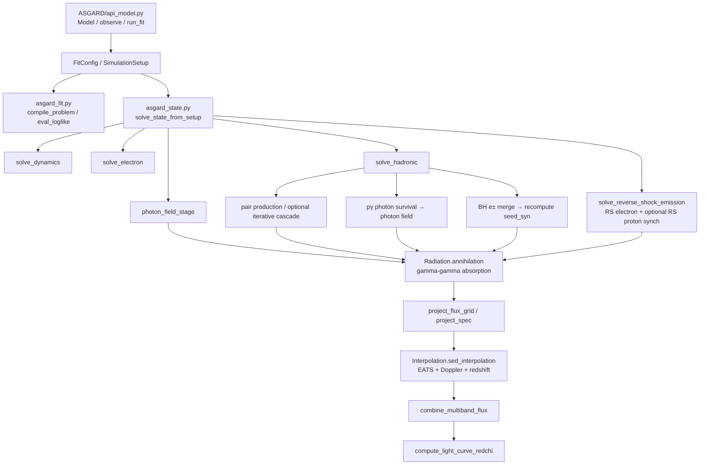
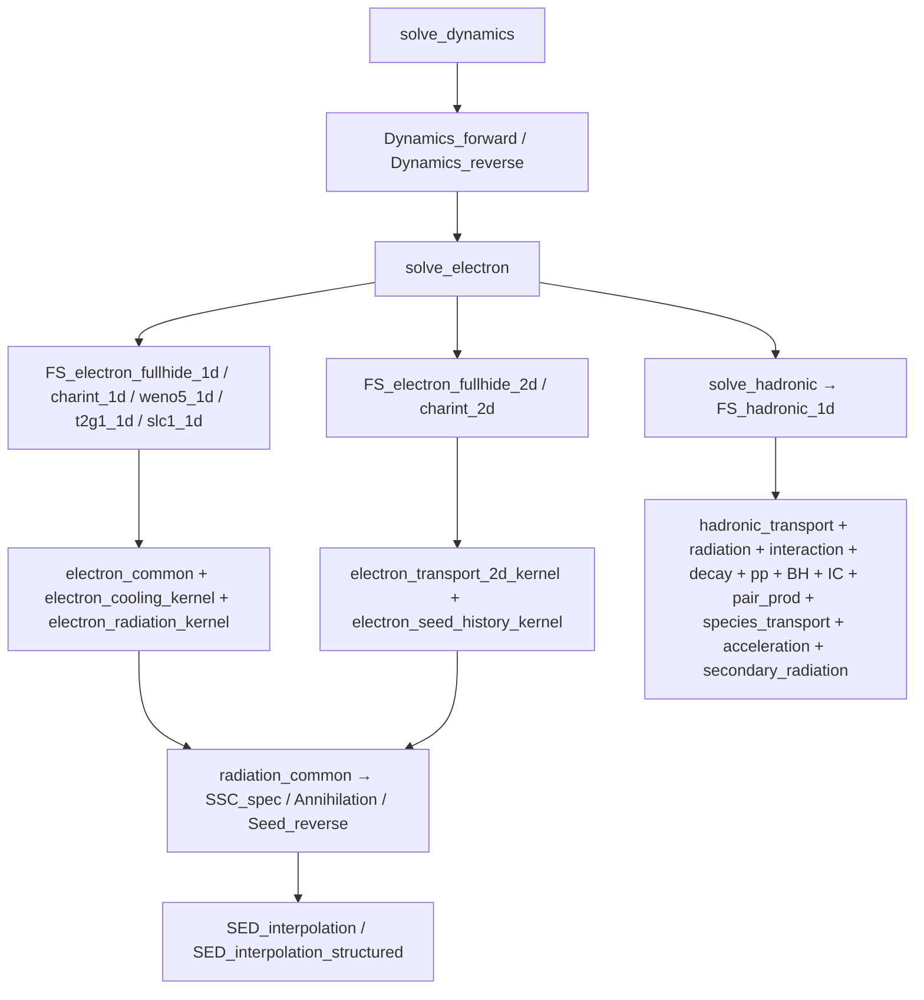

# ASGARD Call Chain

## Python Orchestration Layer



## Fortran Kernel Layer



## Effective Mainline

```text
Model.flux_density_grid
  → solve_state_from_setup
  → solve_dynamics → solve_electron → photon_field_stage
  → solve_hadronic → solve_reverse_shock_emission
  → pair-production branch / Radiation.annihilation → Interpolation.sed_interpolation
  → combine_multiband_flux → FluxResult
```

Fit shortest loop:

```text
Fitter.loglike → eval_loglike → solve_state_from_setup
  → project_flux_grid → combine_multiband_flux → compute_light_curve_redchi
```
