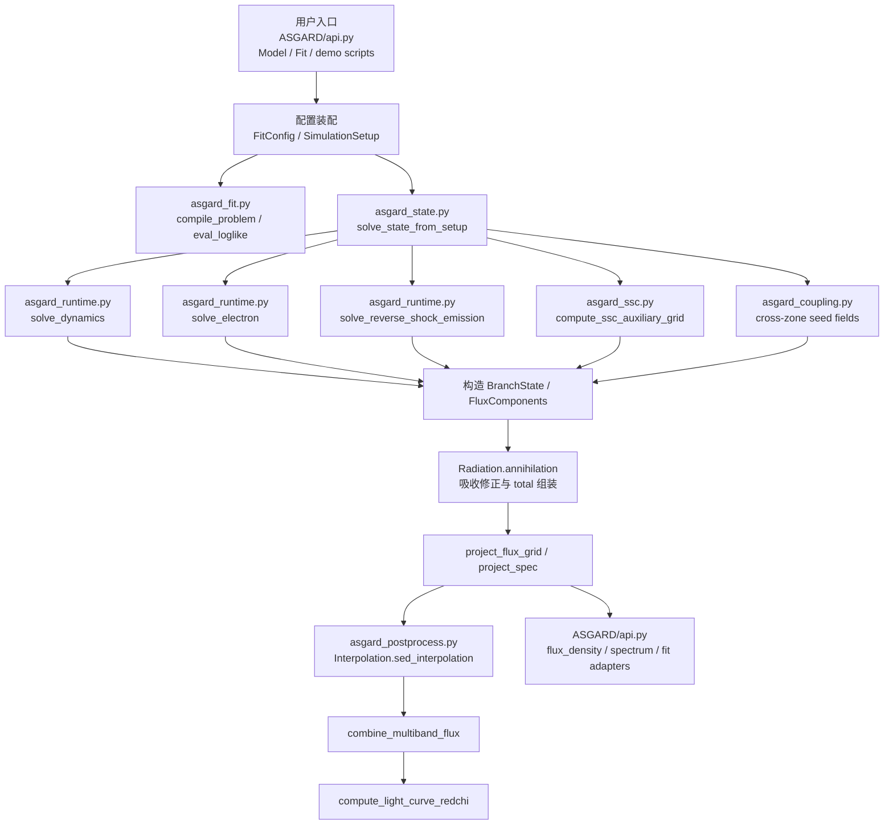
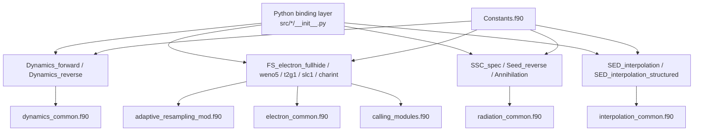
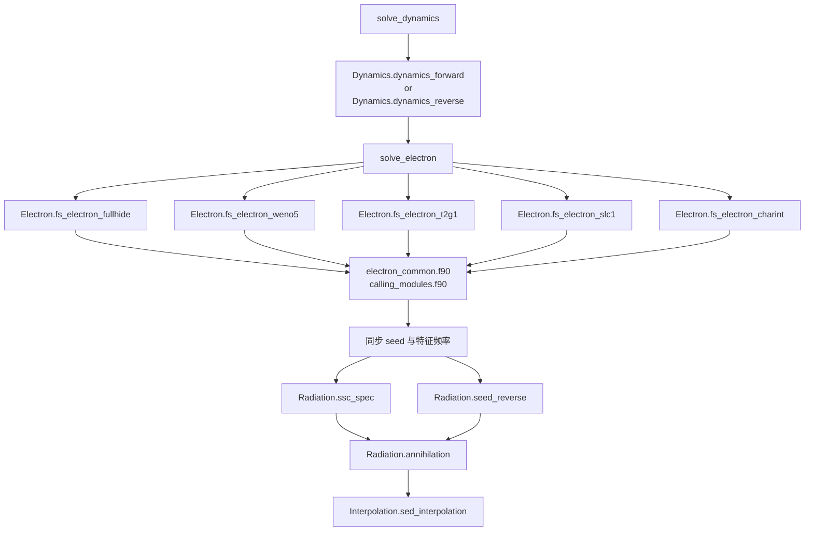

# ASGARD Call Chain

下面的调用链图分成两部分：

- Python 封装层：从高层 API、拟合编排到观测投影。
- Fortran 核调用层：从 f2py 绑定到动力学、电子、辐射、插值内核。

所有关系按当前工作树代码整理，不追溯已经移除的旧 `mergered.py/asgard_solver.py` 路径。

## 1. Python 封装层



### Python 层主线说明

- `ASGARD/api.py`
  - 对外提供 `Model`、`ObsData`、`Fitter`、`flux_density_grid`、`spectrum` 等高层接口。
  - 把几何、介质、参数对象翻译成 `FitConfig`，再调用 `solve_state_from_setup(...)`。

- `asgard_fit.py`
  - 是“拟合时最短路径”。
  - `eval_loglike(...)` 内部走：
    - `build_simulation_setup(...)`
    - `solve_state_from_setup(...)`
    - `project_flux_grid(...)`
    - `combine_multiband_flux(...)`
    - `compute_light_curve_redchi(...)`

- `asgard_state.py`
  - 当前物理解链中心。
  - 负责：
    - 动力学
    - 电子谱
    - FS/RS synchrotron
    - FS/RS SSC
    - cross-zone IC
    - `gamma-gamma` 吸收
    - 观测者系投影

- `asgard_postprocess.py`
  - 不再负责主物理求解。
  - 主要负责：
    - `Interpolation.sed_interpolation`
    - band flux 聚合
    - 光变卡方
    - 稠密能谱频率网格

## 2. Fortran 核调用层



### Fortran 层按运行时调用再展开



### Fortran 层职责切分

- `Dynamics_forward.f90`
  - 前向激波动力学。
  - 依赖 `dynamics_common.f90`。

- `Dynamics_reverse.f90`
  - 反向激波动力学与 RS 初值。

- `FS_electron_*.f90`
  - 电子连续性方程的不同离散方案实现。
  - 共享：
    - `electron_common.f90`
    - `calling_modules.f90`
    - `adaptive_resampling_mod.f90`

- `SSC_spec.f90`
  - SSC 积分核。
  - 当前 Python 层会直接调用它，或者先通过 `asgard_ssc.py` 走 auxiliary grid 后再调它。

- `Seed_reverse.f90`
  - 反向激波同步 seed 与谱输出。

- `Annihilation.f90`
  - `gamma-gamma` 吸收核。

- `SED_interpolation.f90`
  - 观测者系 EATS/Doppler 插值主路径。

- `SED_interpolation_structured.f90`
  - 结构化喷流专用插值路径。

## 3. Current Effective Mainline

按当前顶层 Python 调用路径，最常见的有效主链可以压缩为：

```text
ASGARD/api.py
  -> asgard_state.solve_state_from_setup
  -> asgard_runtime.solve_dynamics
  -> asgard_runtime.solve_electron
  -> Radiation.ssc_spec / Radiation.seed_reverse / Radiation.annihilation
  -> Interpolation.sed_interpolation
  -> asgard_postprocess + asgard_fit
```

如果只看拟合 loglike 的最短闭环，则是：

```text
asgard_fit.eval_loglike
  -> solve_state_from_setup
  -> project_flux_grid
  -> combine_multiband_flux
  -> compute_light_curve_redchi
```
