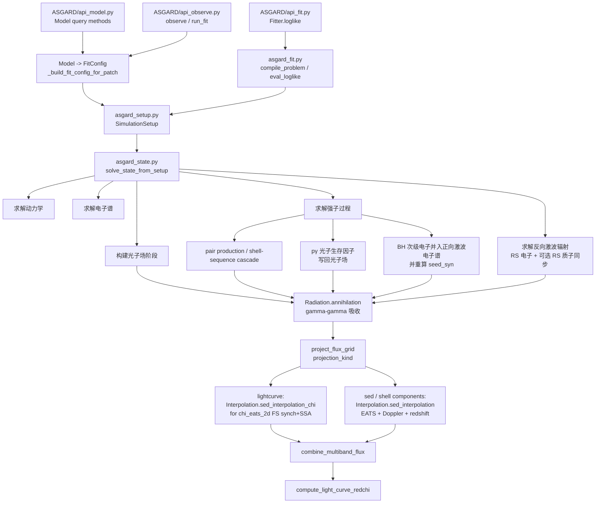
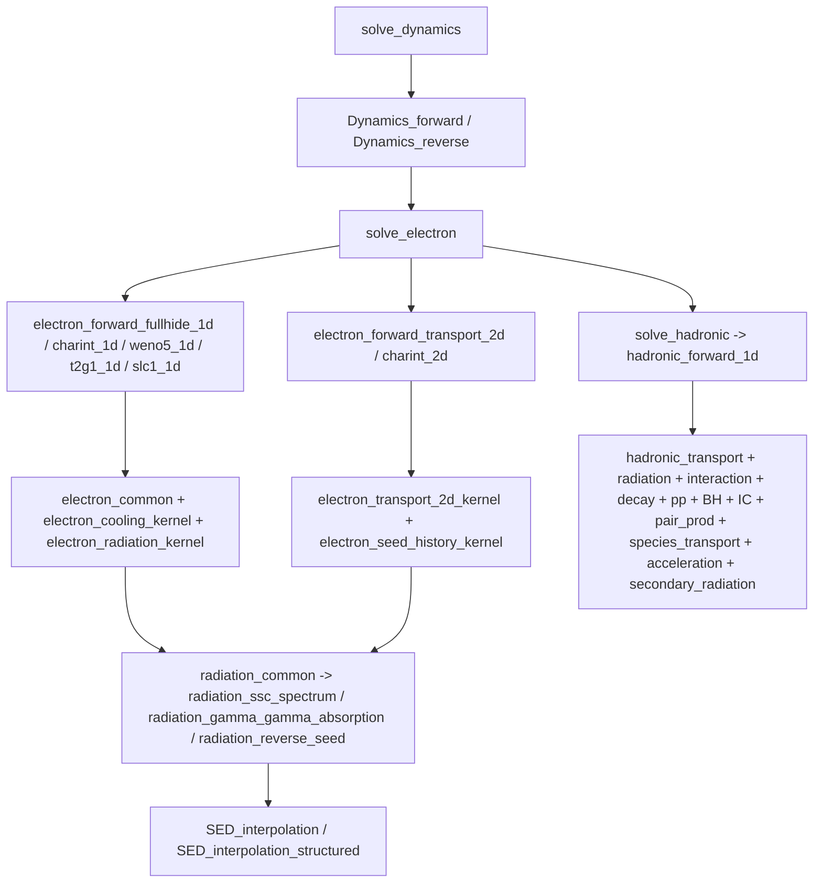

# ASGARD 调用链

## Python 编排层



## Fortran 数值核层



## 有效主线

```text
Model.flux_density_grid
  -> _build_fit_config_for_patch / _solve_patch_state
  -> SimulationSetup
  -> solve_state_from_setup
  -> solve_dynamics -> solve_electron -> photon_field_stage
  -> solve_hadronic -> solve_reverse_shock_emission
  -> pair-production branch / Radiation.annihilation -> project_flux_grid
  -> projection_kind="lightcurve" or "sed"
  -> combine_multiband_flux -> FluxResult
```

拟合最短路径：

```text
Fitter.loglike -> eval_loglike -> solve_state_from_setup
  -> project_flux_grid -> combine_multiband_flux -> compute_light_curve_redchi
```
