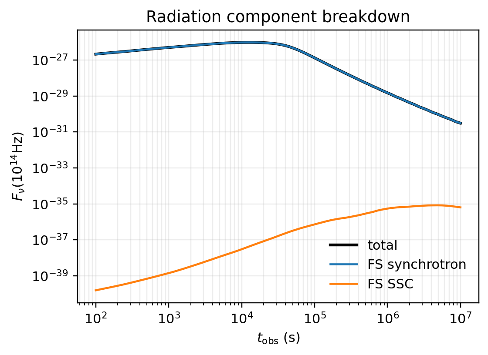
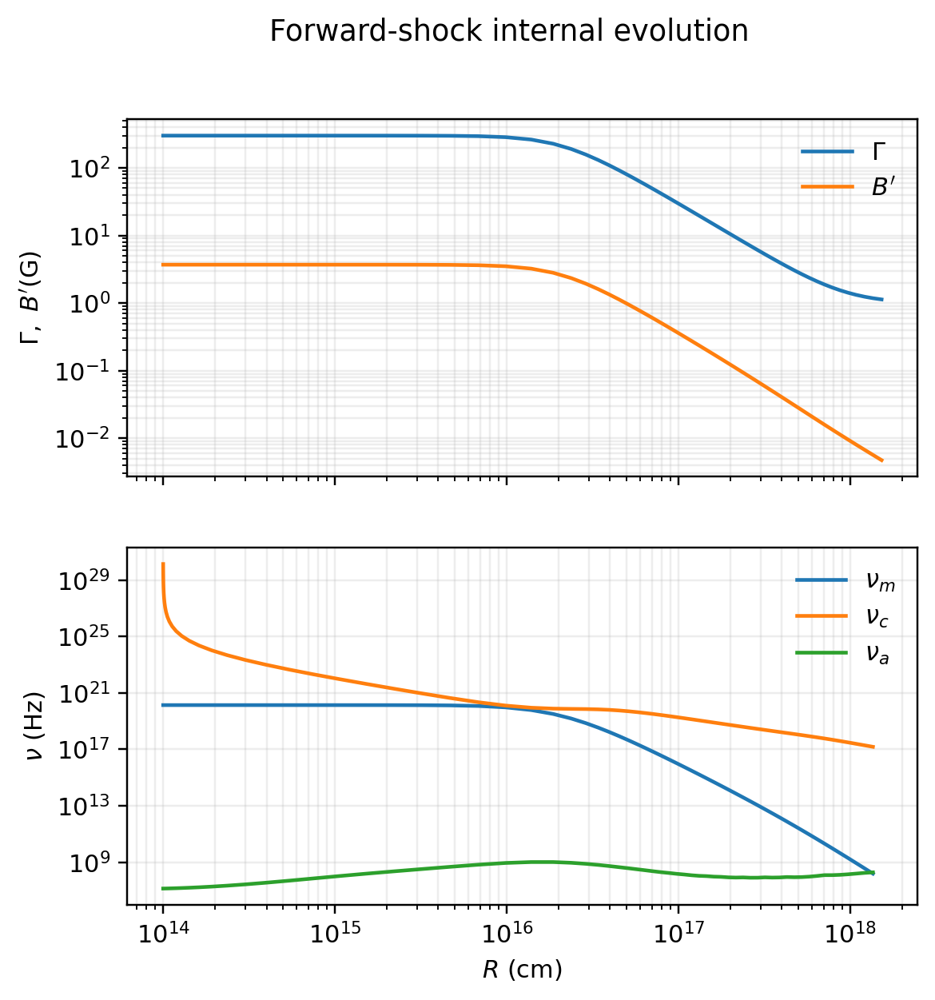

# 教程示例

本文按“先得到光变，再拆分物理分量，再检查内部量，再进入拟合”的顺序组织。所有图像由 `scripts/docs/generate_tutorial_figures.py` 生成，图中的模型与本页代码一致。

## 1. 建立一个最小 ASGARD 模型

```python
from ASGARD import ISM, Model, Observer, Radiation, Setups, TophatJet

model = Model(
    jet=TophatJet(E_iso=1.0e52, Gamma0=300.0, theta_j=0.1),
    medium=ISM(n_ism=1.0),
    observer=Observer(z=0.1, theta_obs=0.0),
    fwd_rad=Radiation(eps_e=0.1, eps_B=1.0e-3, p=2.3, xi_N=0.1, ssc=True),
    setups=Setups(
        electron_solver="fullhide_1d",
        num_r=72,
        num_tobs=72,
        num_gam_e=81,
        num_nu=81,
        observer_time_min_s=1.0e2,
        observer_time_max_s=1.0e7,
    ),
)
```

这个模型包含正向激波同步辐射与 SSC。没有启用反向激波时，`result.rev.sync` 和 `result.rev.ssc` 不应被解释为物理反向激波信号。

## 2. 多频光变

```python
import numpy as np

times = np.logspace(2, 7, 80)
freqs = np.array([1.0e9, 1.0e14, 1.0e18])
result = model.flux_density_grid(times, freqs)
```

输出矩阵 `result.total` 的形状为 `(num_frequency, num_time)`。


光变应随 \(t_{\rm obs}\) 平滑演化。若某个频段出现孤立尖峰，首先检查动力学、电子输运、频率网格和投影路径，不使用 smoothing 掩盖。

## 3. 宽频谱

```python
times = np.array([1.0e3, 1.0e5, 1.0e7])
freqs = np.logspace(8, 22, 110)
result = model.flux_density_grid(times, freqs, projection_kind="sed")
```


固定时刻的谱用于检查 \(\nu_m\)、\(\nu_c\)、\(\nu_a\) 的相对位置，以及 SSC 是否进入观测频段。`projection_kind="sed"` 明确表示固定时刻扫频率。

## 4. 辐射分量拆分

```python
times = np.logspace(2, 7, 80)
result = model.flux_density_grid(times, np.array([1.0e14]))

total = result.total[0]
fwd_sync = result.fwd.sync[0]
fwd_ssc = result.fwd.ssc[0]
```



拆分分量时要先确认对应开关已经启用。例如 `Radiation(..., ssc=True)` 控制正向激波 SSC 辐射参数；`Setups(ssc_cooling=True)` 控制电子冷却中是否包含 SSC 冷却。

## 5. 内部量演化

```python
details = model.details(1.0e2, 1.0e7)
track = details.fwd

radius = track.radius
gamma_bulk = track.Gamma
B_comv = track.B_comv
nu_m = track.nu_m
nu_c = track.nu_c
nu_a = track.nu_a
```



内部量检查是光变验收的必要步骤。若 \(\Gamma(R)\)、\(B'(R)\)、\(\nu_m(R)\)、\(\nu_c(R)\) 或 \(\nu_a(R)\) 不连续，应回到产生该量的数值核，而不是只看最终光变。

## 6. 逐点观测预测

观测数据通常不是完整网格，而是逐点的 \((t_i,\nu_i)\)。此时使用 `flux_density`：

```python
times = np.array([1.0e3, 3.0e4, 1.0e5])
freqs = np.array([1.0e14, 1.0e9, 1.0e18])
points = model.flux_density(times, freqs)
```

`points.total` 是一维数组，与输入点一一对应。

## 7. 频段积分

```python
band_flux = model.flux(
    time_s=1.0e4,
    nu_min_hz=1.0e14,
    nu_max_hz=1.0e18,
    num_points=96,
)
```

该接口对 \(F_\nu\) 做频率积分：

\[
F_{\rm band}(t)
=
\int_{\nu_{\min}}^{\nu_{\max}} F_\nu(t,\nu)\,{\rm d}\nu .
\]

## 8. 模型配置自检

```python
print(model.jet.kind)
print(model.medium.kind)
print(model.observer.z)
print(model.fwd_rad.eps_e, model.fwd_rad.eps_B, model.fwd_rad.p)
```

拟合或 benchmark 前应记录模型配置。若修改了喷流、介质或辐射开关，必须同时更新图像脚本和文档说明。

## 9. 天图入口

ASGARD 提供 `model.sky_image(t_obs, nu_obs, fov, npixel)`。天图依赖观测投影设置，适合放在专题 benchmark 中验证。新手教程先使用光变、谱和内部量完成最小闭环，天图刷新应遵守 `doc/benchmark_refresh_protocol.md`。
