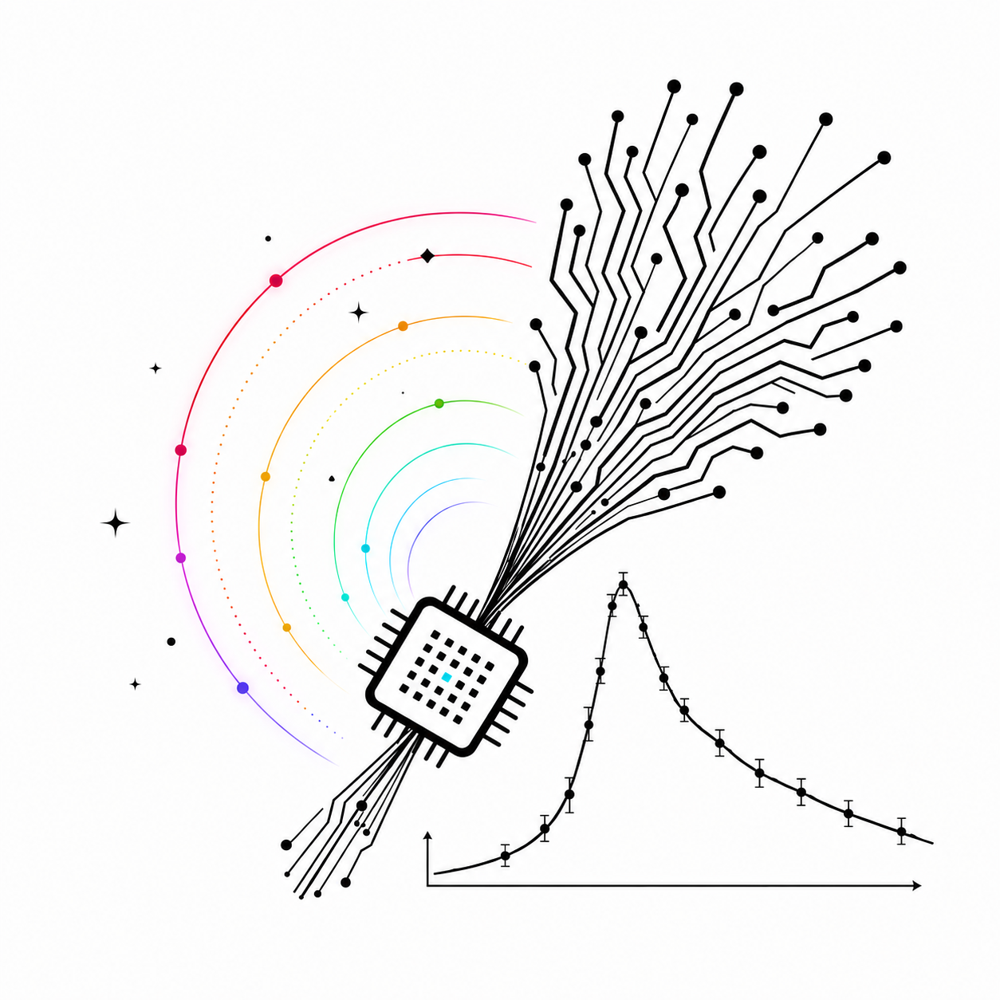

# ASGARD 文档总入口

<p class="asgard-home-logo">
  
</p>

<p class="asgard-home-tagline">
  The Rainbow Bridge of Asgard in Norse mythology has inspired R.J. to name the ASGARD package.
  It traverses the Universe while shining, just like the GRB afterglow.
</p>

<p class="asgard-home-tagline-cn">
  北欧神话中阿斯加德的彩虹桥启发 R.J. 将这一软件包命名为 ASGARD。其辉光横贯宇宙，恰似伽马暴余辉。
</p>

本文档是当前工作树的统一入口。它服务三类读者：

- 使用者：安装项目、运行光变/谱/偏振/天图、读取输出。
- 研究者：理解物理模块、开关、边界和验收口径。
- 开发者：修改 Fortran/Python 主链、重建扩展、刷新 benchmark、提交可追溯结果。

## 推荐阅读路径

首次使用：

1. `README.md`
2. `doc/installation.md`
3. `doc/quickstart.md`
4. `doc/command_line.md`
5. `doc/examples.md`
6. `doc/user_guide.md`
7. `doc/fitting_workflow.md`
8. `doc/mcmc_fitting.md`
9. `doc/external_inference.md`
10. `doc/parameter_reference.md`
11. `doc/public_api.md`
12. `doc/troubleshooting.md`

理解物理和数值主链：

1. `doc/project_physics_design.md`
2. `doc/physical_processes.md`
3. `doc/project_algorithm_design.md`
4. `doc/algorithm_workflow.md`
5. `doc/physics_model.md`
6. `doc/numerical_methods.md`
7. `doc/joint_secondary_feedback_physics.md`
8. `doc/joint_secondary_feedback_algorithm.md`
9. `doc/code_overview.md`
10. `doc/call_chain.md`
11. `doc/code_metrics.md`

开发或刷新基准图：

1. `AGENTS.md`
2. `PLAN.md`
3. `TODO.md`
4. `doc/developer_guide.md`
5. `doc/validation_and_benchmarks.md`
6. `doc/benchmark_refresh_protocol.md`

网页文档发布：

1. `doc/web_docs.md`
2. `mkdocs.yml`
3. `.github/workflows/docs-pages.yml`

专题决策记录：

- `doc/terminology.md`：中文术语表和公式书写规则。
- `doc/command_line.md`：构建、作图、文档和 benchmark 的命令行入口。
- `doc/examples.md`：多频光变、宽频谱、辐射分量、内部量和观测预测教程。
- `doc/mcmc_fitting.md`：从合成数据到 posterior 验收的拟合专题。
- `doc/external_inference.md`：Redback、bilby、BlackJAX 等外部采样器的当前边界和包装方式。
- `doc/public_backend_limits.md`：public API 与 backend 的不支持/部分支持边界。
- `TODO.md`：唯一 TODO / 未完成项入口。
- `doc/project_physics_design.md`：全项目物理设计总纲，覆盖动力学、电子、辐射、强子、级联、偏振、投影和物理验收。
- `doc/physical_processes.md`：物理过程详解，从坐标、动力学、电子、辐射、强子、级联到 EATS 投影逐步推导。
- `doc/project_algorithm_design.md`：全项目算法设计总纲，覆盖状态机、网格、求解器、Python/Fortran 边界、投影、拟合、构建和验证。
- `doc/algorithm_workflow.md`：算法流程详解，解释数组维度、离散方程、`fullhide_1d`、强子 transport、EATS、缓存和验证矩阵。
- `doc/joint_secondary_feedback_physics.md`：含时 BH、二级 e±、光子 sink/source 和 `R` 坐标能量预算的物理契约。
- `doc/joint_secondary_feedback_algorithm.md`：`electron_photon_coupling="joint"` 的状态机、数组契约、函数入口、测试和 benchmark。
- `doc/hadronic_chi_transport_decision.md`：当前不实现 2D / chi-resolved hadronic transport 的理由和前置物理契约。
- `doc/pair_cascade_extension_boundary.md`：当前 gamma-gamma pair/synch cascade 与 IC-mediated electromagnetic cascade 的边界。
- `doc/polarization_timing_diagnostic.md`：Lan 2023 偏振峰时诊断。
- `doc/hadronic_pgamma_notes.md`：p-gamma 微物理和基准说明。
- `doc/am3_migration_plan.md`：AM3 共存、迁移和引用边界。
- `doc/electron_solver_algorithms.md`：电子输运算法说明。
- `doc/fullhide2d_pwn_cr_transport.md`：`fullhide2d_transport_model="pwn_cr_v1"` 的物理契约和边界布局。
- `doc/web_docs.md`：通过 `asgard-private` 发布仅合作者可见 GitHub Pages 文档站的设置和维护流程。

## 当前能力摘要

ASGARD 当前主线是 GRB 余辉的壳层演化爆波和观测者投影模型。Python 层负责公开 API、配置、状态机、后处理、拟合和基准测试；Fortran 层负责高代价数值核。

已登记并可用的主功能：

- 正向激波动力学、电子输运、同步辐射、同步自康普顿、同步自吸收、\(\gamma\gamma\) 吸收和观测者投影。
- 1D 电子求解器：`fullhide_1d`, `slc1_1d`, `charint_1d`, `t2g1_1d`, `weno5_1d`。
- 2D 电子求解器：`fullhide_2d`, `charint_2d`。
- `chi_eats_2d` 观测者投影：FS synchrotron+SSA 使用 \(\chi\) 分辨有限厚壳层；`projection_kind="lightcurve"` 走专用光变投影，`projection_kind="sed"` 走通用 SED 插值器。
- 反向激波电子同步辐射、RS SSC、FS/RS 跨区逆康普顿。
- 反向激波热/磁化基线：使用 shock-front `gamma34` 注入能标、显式 `U3/V3` thermal state、可选 upstream `sigma` 和 ordered magnetic component。
- 正向激波强子 `legacy_1d` 与 formal `am3_1d` research path。
- `electron_photon_coupling="joint"` opt-in 壳层级联合闭合：正向激波电子、光子场、formal 强子输运、BH/pp/\(\gamma\gamma\) 二级 \(e^\pm\) 和 photon survival 在同一 \(R\) 网格上迭代。
- 反向激波强子 light proton-synch path，以及复用 formal 1D 强子核的 full-chain dispatch。
- \(\gamma\gamma\) 对产生与 shell-sequence time-dependent pair/synch cascade。
- 同步辐射偏振 Stokes 投影，覆盖 FS/RS electron synch 与 FS/RS hadronic synch。
- `Model` public API、`Fitter` 拟合 API、benchmark/report 脚本。

未完成项、不支持 backend 边界和实现准入条件集中维护在根目录 `TODO.md` 与 `doc/public_backend_limits.md`，避免文档间分散待办列表。

## 核心入口

Public Python API：

- `ASGARD/api_model.py`：`Model`, `ISM`, `Wind`, jet classes, `Observer`, `Radiation`, `Setups`，以及 `Model` 查询调度和 direct/patch solve 入口。
- `ASGARD/api_observe.py`：`observe`, `run_fit` 兼容入口，以及 sky image / polarization / observation dataset helpers。
- `ASGARD/api_fit.py`：`Fitter`, `Param`, `FitResult`。

Fortran 构建入口：

- `build_extensions.py`

默认强制编译命令：

```bash
rtk bash -lc 'source ~/.wsl_env && cd "/mnt/c/Users/jia/Documents/New project/ASGARD_GRBAfterglow" && TMPDIR=/tmp uv run python build_extensions.py --module electron_forward_fullhide_1d --force'
```

最小文档/格式检查：

```bash
rtk bash -lc 'source ~/.wsl_env && cd "/mnt/c/Users/jia/Documents/New project/ASGARD_GRBAfterglow" && git diff --check'
```

## 文档维护原则

- 文档必须描述当前工作树，而不是理想设计。
- 物理边界必须写明原因、开关、验收口径和不可用范围。
- Benchmark 图像和 CSV 只有在能由脚本复现且命令已记录时才进入版本库。
- Fortran 或物理路径改动后的验证必须记录编译命令、line-truncation 检查和最小 smoke test。
- 不使用经验 smoothing、fallback、后处理补丁掩盖非连续或非光滑结果；物理量随时间/空间不光滑时优先查 bug。
