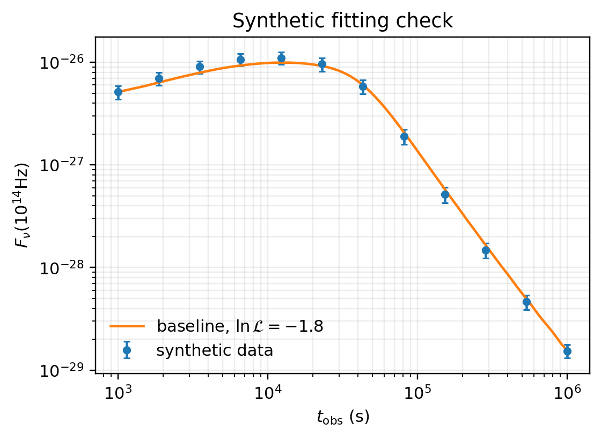

# MCMC 拟合专题

本文扩展 `doc/fitting_workflow.md`，说明从合成数据到 likelihood 检查、采样和 posterior 验收的完整路径。核心原则是先证明模型和数据契约正确，再增加参数维度。

## 1. 从最小模型开始

```python
from ASGARD import Fitter, ISM, Model, Observer, Param, Radiation, Scale, Setups, TophatJet

model = Model(
    jet=TophatJet(E_iso=1.0e52, Gamma0=300.0, theta_j=0.1),
    medium=ISM(n_ism=1.0),
    observer=Observer(z=0.1, theta_obs=0.0),
    fwd_rad=Radiation(eps_e=0.1, eps_B=1.0e-3, p=2.3, xi_N=0.1, ssc=True),
    setups=Setups(electron_solver="fullhide_1d", num_r=72, num_tobs=72),
)
```

初次拟合只打开正向激波电子辐射。只有残差结构或科学问题要求时，才增加 wind、结构化喷流、反向激波、强子过程或 pair cascade。

## 2. 加载观测数据

```python
fitter = Fitter(model=model)
fitter.add_flux_density(times_s, nu_hz, flux, flux_err)
```

`times_s`、`nu_hz`、`flux`、`flux_err` 必须是同长度数组。单位为秒、Hz、cgs flux density。星等、\(\mu{\rm Jy}\)、mJy、能段 flux 等格式应在读入边界完成转换。

## 3. 绑定参数

```python
fitter.params = [
    Param("logE", "jet.E_iso", 50.0, 54.0, Scale.LOG10),
    Param("logn", "medium.n_ism", -4.0, 2.0, Scale.LOG10),
    Param("logepsB", "fwd_rad.eps_B", -6.0, -1.0, Scale.LOG10),
    Param("p", "fwd_rad.p", 2.0, 2.8, Scale.LINEAR),
]
```

`Scale.LOG10` 表示采样变量 \(x\) 写入模型前变为 \(10^x\)。参数边界应来自物理假设和数据约束能力，而不是为了让采样器更容易运行。

## 4. 先检查 likelihood

```python
ll = fitter.loglike({"logE": 52.0, "logn": 0.0, "logepsB": -3.0, "p": 2.3})
```

ASGARD 当前使用独立高斯误差：

\[
\ln\mathcal{L}
=
-\frac{1}{2}
\sum_i
\left[
\frac{
F_{\nu,{\rm model}}(t_i,\nu_i)
-
F_{\nu,{\rm obs},i}
}{
\sigma_i
}
\right]^2 .
\]



上图使用 `scripts/docs/generate_tutorial_figures.py` 生成的合成数据。它用于检查数据绑定、单位、模型预测和 likelihood 的最小闭环，不替代正式 posterior。

## 5. 运行采样

```python
result = fitter.fit(
    sampler="emcee",
    total_steps=512,
    burn_frac=0.5,
    thin=2,
    nwalkers=24,
)
```

正式运行前先用 quick grid 判断参数范围和退化方向。正式 posterior 应固定随机种子、记录 git HEAD、编译命令、采样器设置、数据版本和输出目录。

## 6. 分析结果

```python
print(result.best_params)
print(result.best_loglike)
print(result.labels)
```

若安装了 `corner`，可画 corner 图：

```python
import corner

fig = corner.corner(result.samples, labels=result.labels)
fig.savefig("posterior_corner.png", dpi=220)
```

posterior 图像是 artifact。只有当脚本、命令和输入数据都可追溯时，才应纳入版本库。

## 7. 拟合后的物理验收

拟合不是只看 \(\chi^2\)。best-fit 和 posterior 样本应检查：

- 多频光变连续平滑。
- SED 随时间演化连续。
- \(\Gamma(R)\)、\(B'(R)\)、\(\nu_m(R)\)、\(\nu_c(R)\)、\(\nu_a(R)\) 没有孤立尖峰。
- posterior 不靠无物理意义的边界取胜。
- 新增物理分量确实解释残差，而不是吸收单位错误或数据筛选错误。

## 8. 复杂模型准入

复杂模型只在有明确决策价值时加入：

- wind：早晚期斜率或环境证据要求。
- 结构化喷流：off-axis 几何或多波段峰时无法由 tophat 解释。
- 反向激波：早期光学/射电 excess 和 crossing 物理要求。
- 强子过程：高能谱、neutrino 或 secondary feedback 是科学问题核心。

如果某个方向已经可预见不会改变结论，不做低信息增益穷举。
