# 物理模型

本文档描述当前 ASGARD 已实现的物理模型和边界。这里记录的是代码契约，不是完整教材式推导。全项目物理设计总纲见 `doc/project_physics_design.md`。

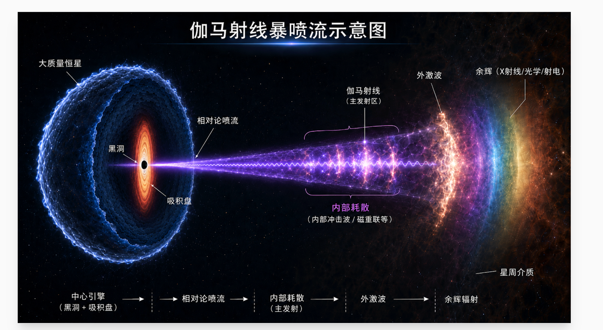

## 总体图像

ASGARD 的主线是：

```text
relativistic blast wave
  -> electron / proton distribution evolution
  -> local radiation and photon fields
  -> absorption / cascade / cross-zone coupling
  -> equal-arrival-time observer projection
```

Python 层组织状态机、配置和观测投影；Fortran 层求解电子、辐射、动力学和强相互作用微物理核。

## 物理过程图示索引

下列示意图由 `tools/generate_doc_schematics.py` 使用 Python/matplotlib 生成，网页使用 PNG，`doc/assets/figures/physics/` 中同时保留可编辑 SVG、PDF 和 TIFF。图中公式用于标记代码必须守住的物理契约；完整公式和边界仍以正文为准。

| 物理过程 | 示意图 |
| --- | --- |
| 总体物理链 | 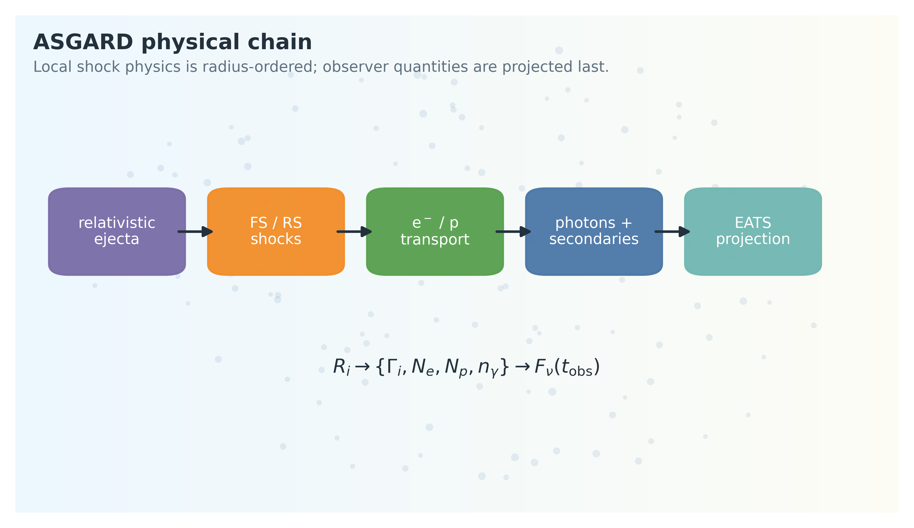{ width="320" } |
| 坐标、时间和 Doppler 因子/等到达时间面映射 | 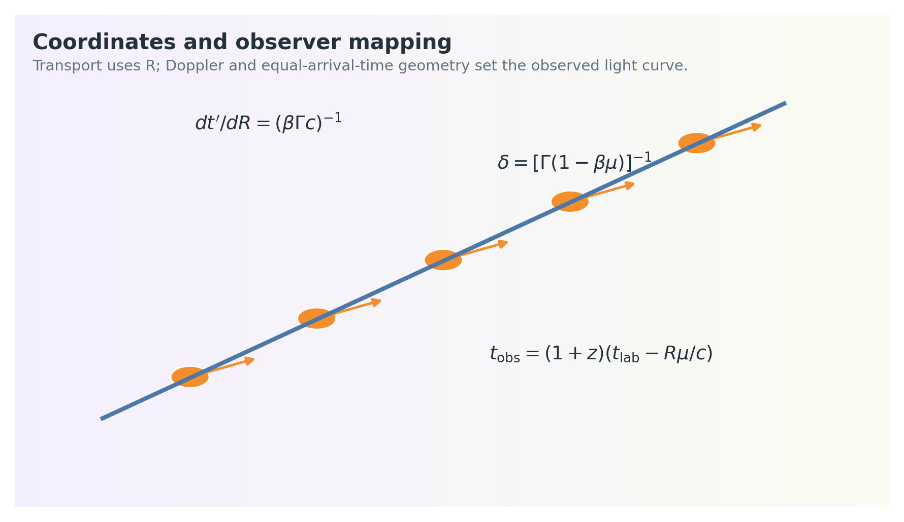{ width="320" } |
| 外部介质、密度增强和喷流角向结构 | 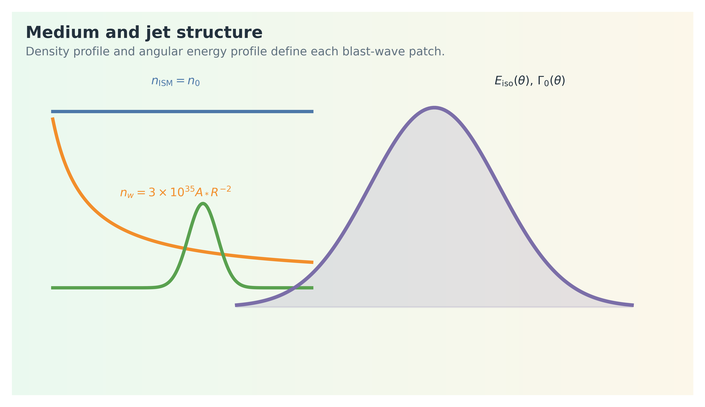{ width="320" } |
| 正向激波动力学 | 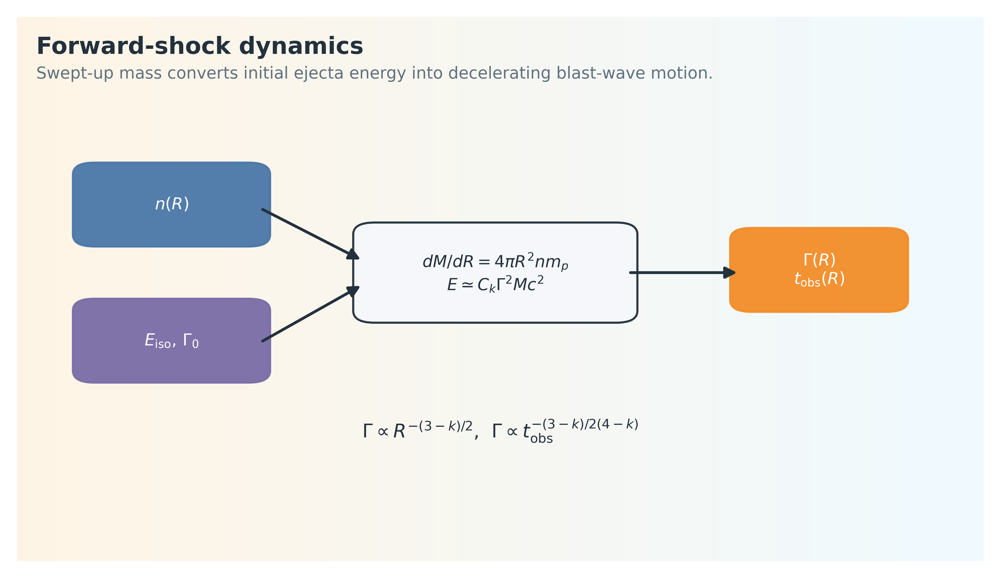{ width="320" } |
| 电子注入和输运 | 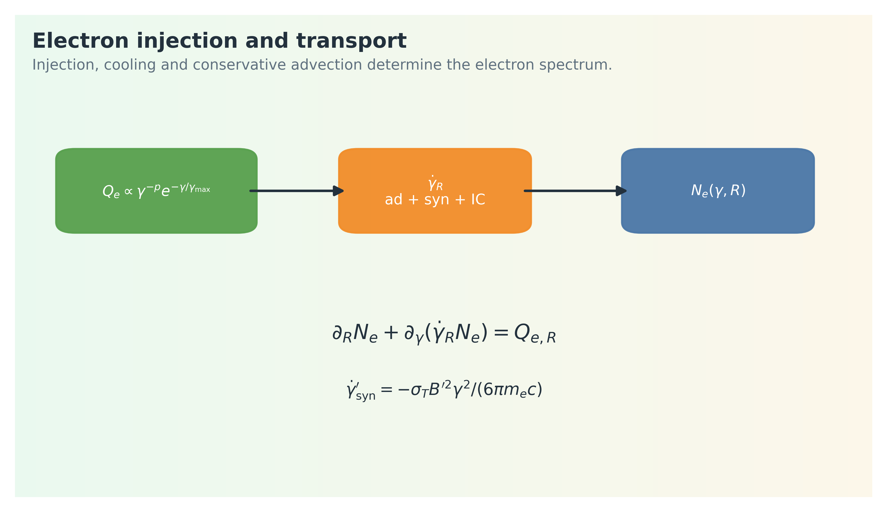{ width="320" } |
| 同步辐射、SSA 与 SSC | 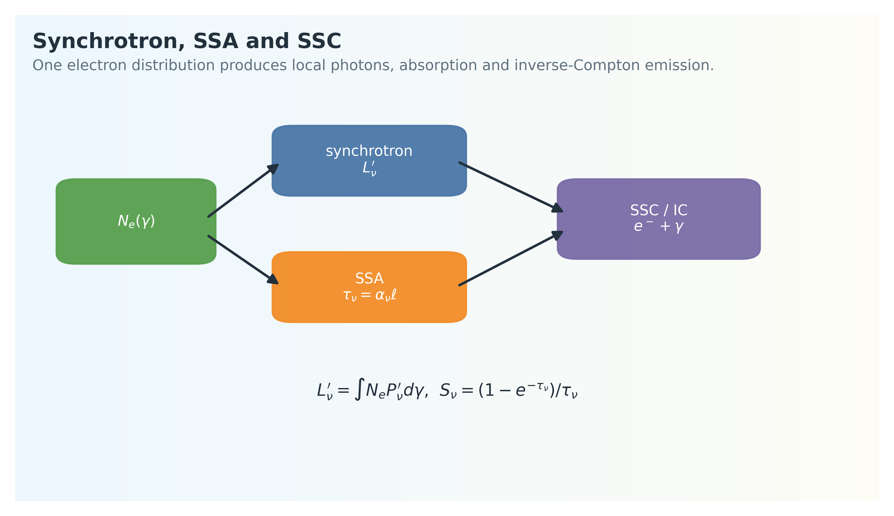{ width="320" } |
| 强子输运 | 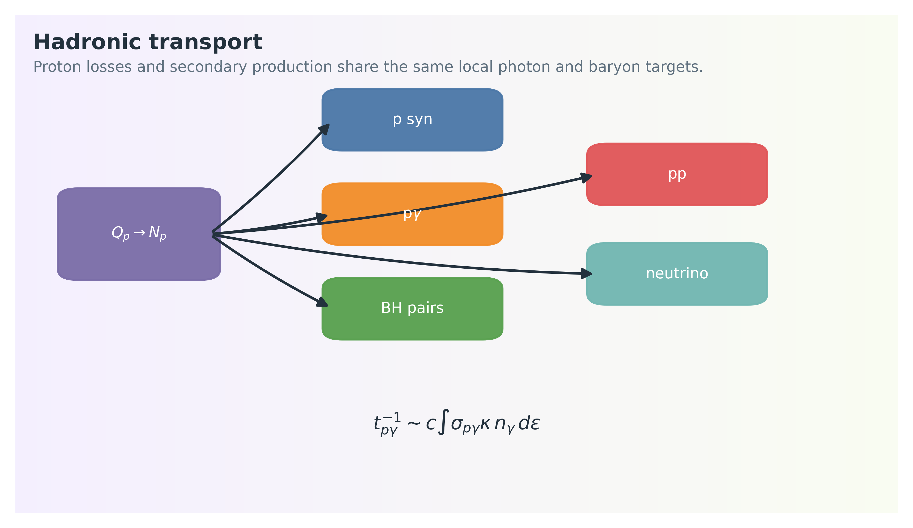{ width="320" } |
| 含时二级反馈 | 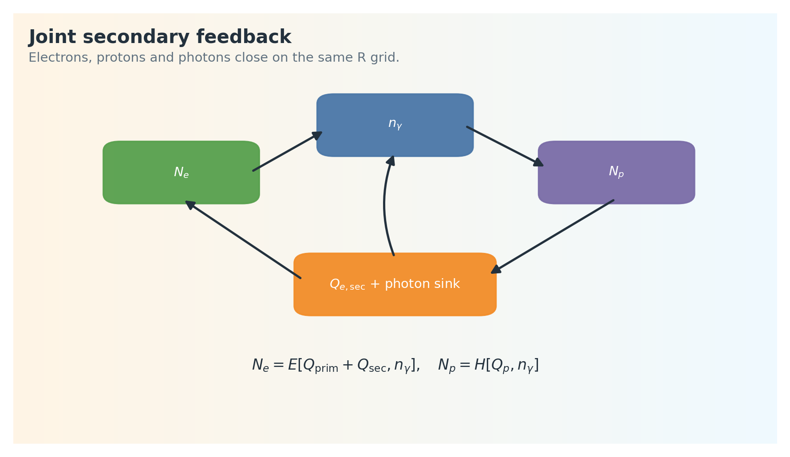{ width="320" } |
| \(\gamma\gamma\) 对产生与 pair cascade | 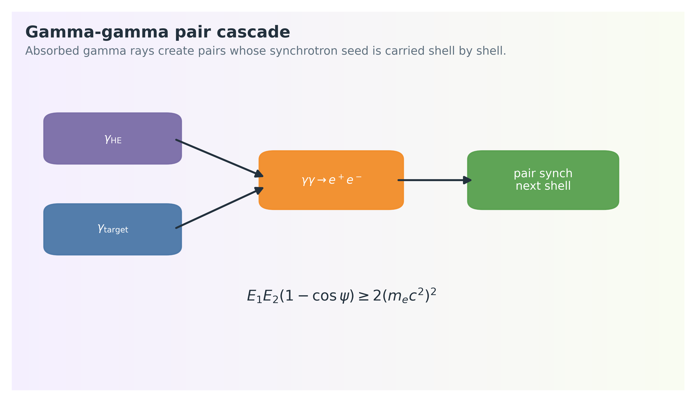{ width="320" } |
| 反向激波和次级反向激波 | 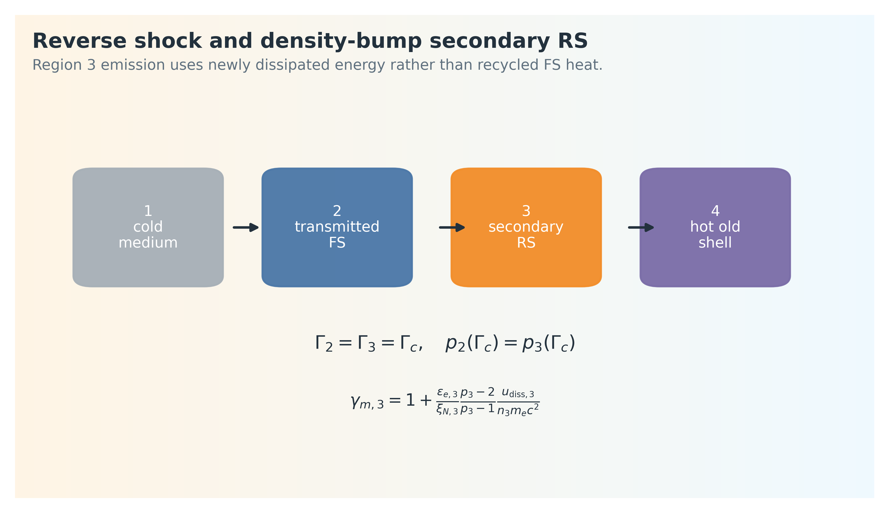{ width="320" } |
| \(\chi\) 分辨有限厚度投影 | 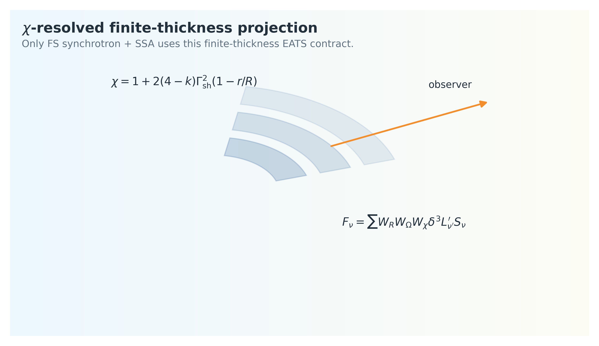{ width="320" } |

## 正向激波

正向激波分支包含：

- blast-wave dynamics
- electron injection and transport
- synchrotron radiation
- synchrotron self-absorption
- SSC and Compton cooling
- gamma-gamma absorption
- optional hadronic emission and feedback
- 可选壳层级 electron-photon-hadronic 联合反馈
- observer-frame projection

重要微物理参数：

- `epsilon_e`：电子能量分数。
- `epsilon_B`：磁场能量分数。
- `p`：注入电子谱指数。
- `accelerated_electron_fraction`：非热电子数分数 \(\xi_N\)。
- `include_ssc`：是否输出 SSC。
- `ssc_cooling_mode`：冷却中是否包含 Compton 项以及使用哪种近似。

电子谱演化是核心物理状态，不能用后处理 smoothing 修复不连续结果。

## 电子输运

当前登记求解器：

- `fullhide_1d`：默认稳定基线，适合一般 public runtime 和拟合。
- `fullhide_1d_hz`：1D hybrid/hz 变体，服务特定诊断和回归路径。
- `slc1_1d`：semi-Lagrangian / characteristic family path。
- `charint_1d`：characteristic integration path。
- `t2g1_1d`：legacy implicit transport path。
- `weno5_1d`：高阶电子谱解析路径。
- `fullhide_2d`：energy + chi resolved electron transport。
- `charint_2d`：2D characteristic path。
- `fullhide_2d_pic`：2D PIC/实验路径，不作为普通拟合默认。

电子输运输出：

- `gam_e`
- `d_n_gam_e`
- `l_syn_spec`
- `seed_syn`
- `nu_m`
- `nu_c`
- `nu_a`

2D path 额外输出：

- `d_n_gam_e_chi`
- `chi_grid`
- `l_syn_spec_chi`
- `seed_syn_chi`
- `tau_syn_chi`
- `chi_radius_cm`
- `chi_gamma_bulk`
- `chi_dvolume_weight`

`solver_options.geometry_projection="chi_eats_2d"` 是 `fullhide_2d` / `charint_2d` 的 opt-in observer projection。该 public API 字段会写入底层 `geometry_kernel`。该路径仅对正向激波同步辐射+SSA 使用 \(\chi\) 分辨有限厚壳层等到达时间面；SSC、强子和 pair cascade 仍是壳层级契约。完整几何、输运、SSA survival、transport-to-projection 重映射和薄壳极限见 `doc/shock_shell_adaptive_algorithms.md`。

## 同步辐射、SSA 与 SSC

同步辐射核：

- `src/Electron/electron_radiation_kernel.f90`
- `src/Radiation/radiation_common.f90`

SSA cooling 和 transfer：

- `src/Electron/electron_cooling_kernel.f90`
- `src/Radiation/radiation_common.f90`

SSC：

- `src/Radiation/radiation_ssc_spectrum.f90`
- `asgard_core/asgard_ssc.py`

SSC、强子、pair cascade 当前仍是壳层级契约。启用 `chi_eats_2d` 不表示这些通道已经 \(\chi\) 局域自洽。

当前同步辐射积分选择中，`index_syn_integr=1/2` 是固定网格快速路径；adaptive path 只作为显式诊断路径使用，不作为 public 默认。

## 反向激波

反向激波当前基线：

- electron synchrotron
- RS SSC
- FS/RS cross-zone IC
- optional RS hadronic light path
- 可选 full-chain RS hadronic dispatch，复用 formal 1D 强子核

关键物理约束：

- 注入能标使用 shock-front `gamma34`。
- 区域 3 湍动磁场和 crossing 后热演化使用显式 `U3/V3` thermal state。
- `reverse_sigma` 引入上游磁化；磁化 jump 使用 VegasAfterglow 的 jump-condition 形式作为来源和 comparison backend。
- `B3` 是 turbulent + ordered total field。
- `sigma -> 0` 必须回到当前非磁化 baseline。

VegasAfterglow 在当前项目中是 comparison backend，不是光变目标或 RS 物理基准。

抛射物反向激波与密度增强触发的次级反向激波的完整四区图像、\(\gamma_{34}\)、区域 3 reservoir、磁化压缩比、热上游 Riemann 问题和新增耗散能公式见 `doc/shock_shell_adaptive_algorithms.md`。

## 强子过程

Forward-shock hadronic solver：

- `legacy_1d`：proton transport + proton synchrotron baseline。
- `am3_1d`：formal research path，覆盖 p-gamma、BH、pp、hadronic IC、secondary species transport、secondary radiation、pair production branch、neutrino。

Hadronic process switches 使用公开 API 字段名：

- `proton_energy_fraction`：质子能量分数，物理公式中常记为 \(\epsilon_p\)。
- `proton_synch`
- `include_pgamma`
- `bethe_heitler`
- `hadronic_inverse_compton`
- `pp`
- `neutrino`
- `pair_production`
- `pgamma_scheme`
- `acceleration_efficiency`：加速效率参数，物理公式中常写为 \(\eta_{\rm acc}\)。

RS hadronic：

- `hadronic_reverse_1d`：light proton injection/transport + proton synchrotron。
- Full-chain RS path 使用 `hadronic_forward_1d` formal kernels，并使用 RS seed photons、RS `B3`、shell energy 和 baryon target density。

当前 hadronic 边界：

- Hadronic transport 保持 1D 壳层级。
- 2D / \(\chi\) 分辨 hadronic transport 有意不实现。
- 未来若扩展，必须先定义 \(\chi\)-local photon field、hadron density、secondary feedback 和 observer projection。

## 含时二级反馈与光子场闭合

`SolverOptions(electron_photon_coupling="separated" | "joint")` 控制 forward electron、photon field 和 formal hadronic path 的阶段耦合方式。

`separated` 是默认模式：

```text
electron solver -> photon field -> hadronic -> separated BH merge/recompute seed
```

`joint` 是 opt-in 模式，只在 forward-shock、`fullhide_1d`、`am3_1d`、BH enabled、SSC cooling enabled 的壳层级 1D 契约下启用：

```text
electron state -> photon field -> hadronic transport
-> secondary electron source + photon source/sink
-> electron solve with external Qe and IC seed
-> photon field rebuild
```

物理坐标固定为半径 \(R\)。任一自然单位为 \({\rm s}^{-1}\) 的冷却、反应或吸收率进入输运前都必须乘以

\[
\frac{\mathrm{d}t'}{\mathrm{d}R}
=\frac{1}{\beta\Gamma c}.
\]

当前 joint 电子方程接入 BH pairs、pp pairs 和 gamma-gamma pairs。pγ/π/μ 链的 e± 注入只有在 formal kernel 明确输出谱形和能量预算后才能反馈；当前不能用总能量守恒外推构造临时谱。光子场 sink 使用 formal pγ survival、BH photon loss 和 gamma-gamma absorption；不允许用经验 sink 或 smoothing 补齐。

完整物理契约见 `doc/joint_secondary_feedback_physics.md`，算法契约见 `doc/joint_secondary_feedback_algorithm.md`。

## 对产生与级联

当前已实现路径：

- observer-side gamma-gamma attenuation
- pair-production branch
- `pair_cascade_iterations > 1` 时使用 shell-sequence time-dependent gamma-gamma pair/synch cascade

未实现：

- IC-mediated electromagnetic cascade。

原因是该扩展需要 photon/e± source-sink 方程、IC kernel 契约和 energy-budget benchmark。见 `doc/pair_cascade_extension_boundary.md`。

## 偏振

偏振路径：

- synchrotron Stokes projection
- FS/RS electron synch
- FS/RS hadronic synch

非同步辐射分支不混入 polarization Stokes。当前 Lan 2023 对比记录显示峰值幅度已匹配，峰时仍偏早；现有证据指向 dynamics/jet-evolution benchmark，而不是 projection-layer 修正。

## 观测者投影

Observer stage 组合：

- 等到达时间面/Doppler 因子 interpolation
- redshift 和 luminosity distance
- synchrotron/SSC/hadronic/RS/cross-zone components
- absorption factors
- structured jet 和 sky image 的 patch integration

主要 Fortran interpolation：

- `src/Interpolation/SED_interpolation.f90`
- `src/Interpolation/SED_interpolation_structured.f90`

Projection-layer 修正不能用来掩盖 dynamics 或 transport bug。

## 公式级物理模型

本节把当前 ASGARD 的主要物理链写成连续方程形式。代码实现不一定逐项显式使用同一教材符号，但每个公式都对应一个必须守住的物理契约：变量单位、参考系、源项和 sink 不能混用。

### 坐标、时间和 Doppler 变换

主演化坐标是 shock radius \(R\)。共动时间、实验室时间和观测者时间的基本关系为

\[
\frac{\mathrm{d}t'}{\mathrm{d}R}
=
\frac{1}{\beta\Gamma c},
\qquad
\frac{\mathrm{d}t_{\rm lab}}{\mathrm{d}R}
=
\frac{1}{\beta c},
\]

其中 \(t'\) 是 shocked fluid 共动系时间，\(\Gamma\) 是 bulk Lorentz factor，\(\beta=(1-\Gamma^{-2})^{1/2}\)。任意微物理 rate 若天然单位是 \({\rm s}^{-1}\)，进入 \(R\) 坐标输运时都要乘以 \(\mathrm{d}t'/\mathrm{d}R\)。这是 joint feedback、电子冷却和强子损失共用的单位契约。

观测者时间为

\[
t_{\rm obs}
=
(1+z)
\left[
t_{\rm lab}
-
\frac{R\mu}{c}
\right],
\qquad
\mu=\cos\alpha .
\]

Doppler 因子定义为

\[
\delta
=
\frac{1}{\Gamma(1-\beta\mu)} .
\]

频率和谱功率变换为

\[
\nu_{\rm obs}
=
\frac{\delta}{1+z}\nu',
\qquad
F_{\nu_{\rm obs}}
=
\frac{1+z}{4\pi d_L^2}
\int
\delta^3 L'_{\nu'}\,\frac{\mathrm{d}\Omega}{4\pi}.
\]

实现中 `SED_interpolation.f90` 的 `doppler` 变量对应 \(D=\delta^{-1}\)，所以代码里常出现 \(D^{-3}\) 和 \(\nu'=(1+z)D\nu_{\rm obs}\)。读代码时不能把该变量名误读为 \(\delta\)。

### 外部介质、喷流结构和 swept-up mass

当前公开介质模型为

\[
n_{\rm ISM}(R)=n_0,
\qquad
n_{\rm wind}(R)
=
\frac{3.0\times10^{35}A_\ast}{R^2},
\]

以及显式表格密度 \(n(R)\)。多 bump 密度可写为

\[
n(R)
=
n_0
\left[
1+
\sum_j(f_j-1)
\exp\left(
-
\frac{(\log_{10}R-\log_{10}R_j)^2}{2w_j^2}
\right)
\right].
\]

swept-up mass 的连续形式是

\[
\frac{\mathrm{d}M_{\rm sw}}{\mathrm{d}R}
=
4\pi R^2 n(R)m_p
\]

对 spherical isotropic-equivalent patch 成立。结构化喷流中每个角向 patch 使用自己的 \(E_{\rm iso}(\theta,\phi)\) 和 \(\Gamma_0(\theta,\phi)\)，再经角向权重相加。常用喷流剖面包括：

\[
E_{\rm iso}^{\rm top}(\theta)
=
\begin{cases}
E_0,&\theta\le\theta_j,\\
0,&\theta>\theta_j,
\end{cases}
\]

\[
E_{\rm iso}^{\rm gauss}(\theta)
=
E_0\exp\left(-\frac{\theta^2}{2\theta_c^2}\right),
\qquad
\Gamma_0^{\rm gauss}(\theta)-1
=
(\Gamma_{0,c}-1)
\exp\left(-\frac{\theta^2}{2\theta_c^2}\right),
\]

\[
E_{\rm iso}^{\rm pl}(\theta)
=
\begin{cases}
E_0,&\theta\le\theta_c,\\
E_0(\theta/\theta_c)^{-k_E},&\theta_c<\theta\le\theta_{\max},\\
0,&\theta>\theta_{\max}.
\end{cases}
\]

这些是初始角向能量和 Lorentz 因子剖面，不等价于已实现横向扩张动力学。

### 正向激波动力学

绝热相对论 blast wave 的能量量级为

\[
E_{\rm iso}
\simeq
C_k\Gamma^2M_{\rm sw}c^2,
\]

其中 \(C_k\) 是与密度剖面和精确定义有关的量级系数。由 \(M_{\rm sw}\propto R^{3-k}\) 得到 Blandford-McKee 标度

\[
\Gamma(R)\propto R^{-(3-k)/2},
\qquad
t_{\rm obs}\propto\frac{R}{\Gamma^2c},
\]

因此

\[
\Gamma(t_{\rm obs})
\propto
t_{\rm obs}^{-(3-k)/[2(4-k)]}.
\]

均匀介质 \(k=0\) 给出 \(\Gamma\propto R^{-3/2}\)、\(\Gamma\propto t_{\rm obs}^{-3/8}\)；wind \(k=2\) 给出 \(\Gamma\propto R^{-1/2}\)、\(\Gamma\propto t_{\rm obs}^{-1/4}\)。这些标度是验收基线，不替代 Fortran 动力学右端项。

若存在能量注入，

\[
\frac{\mathrm{d}E}{\mathrm{d}t_{\rm lab}}
=
L_{\rm inj}(t_{\rm lab})-L_{\rm rad}(t_{\rm lab}),
\]

则 plateau 或 rebrightening 必须能由 \(L_{\rm inj}\)、介质结构或 shock crossing 的物理时间尺度解释。没有明确源项时，后处理时间平移或 smoothing 不是可接受物理模型。

### 磁场和电子注入

shock 后内能密度记为 \(u'\)。湍动磁场为

\[
B'
=
\sqrt{8\pi\epsilon_Bu'}.
\]

若反向激波 upstream magnetization 为 \(\sigma\)，总磁场写成

\[
B_3
=
\sqrt{B_{\rm turb}^2+B_{\rm ord}^2},
\qquad
\lim_{\sigma\to0}B_3=B_{\rm turb}.
\]

非热电子注入谱为

\[
Q_e(\gamma)
=
Q_0\gamma^{-p}
\exp\left(-\frac{\gamma}{\gamma_{\max}}\right)
H(\gamma-\gamma_m).
\]

数归一化和能量归一化分别为

\[
\int_{\gamma_m}^{\gamma_{\max}}
Q_e(\gamma)\,\mathrm{d}\gamma
=
\xi_N\,\mathrm{d}N_{\rm sh},
\]

\[
m_ec^2
\int_{\gamma_m}^{\gamma_{\max}}
(\gamma-1)Q_e(\gamma)\,\mathrm{d}\gamma
=
\epsilon_e\,\mathrm{d}E_{\rm sh}.
\]

当 \(p>2\) 且 cutoff 远高于 \(\gamma_m\) 时，

\[
\gamma_m
\simeq
1+
\frac{\epsilon_e}{\xi_N}
\frac{p-2}{p-1}
\frac{m_p}{m_e}
(\Gamma_{\rm rel}-1).
\]

这只是解释性极限。代码必须用精确归一化处理 \(p\to2\)、有限 \(\gamma_{\max}\) 和 thermal branch。

### 电子输运、冷却和特征频率

电子谱在 \(R\) 坐标中的连续方程是

\[
\frac{\partial N_e}{\partial R}
+
\frac{\partial}{\partial\gamma}
\left[
\dot{\gamma}_R N_e
\right]
=
Q_{e,R},
\]

其中

\[
\dot{\gamma}_R
=
\frac{\mathrm{d}\gamma}{\mathrm{d}R}
=
\frac{\mathrm{d}t'}{\mathrm{d}R}
\left(
\dot{\gamma}'_{\rm ad}
+
\dot{\gamma}'_{\rm syn}
+
\dot{\gamma}'_{\rm IC}
+
\dot{\gamma}'_{\rm SSA}
\right).
\]

同步冷却为

\[
\dot{\gamma}'_{\rm syn}
=
-
\frac{\sigma_TB'^2}{6\pi m_ec}
\gamma^2.
\]

绝热冷却可抽象为

\[
\dot{\gamma}'_{\rm ad}
=
-
\frac{\gamma}{3}
\frac{\mathrm{d}\ln V'}{\mathrm{d}t'}.
\]

Thomson 极限 IC 冷却为

\[
\dot{\gamma}'_{\rm IC,T}
=
-
\frac{4\sigma_T}{3m_ec}
U'_{\rm ph}\gamma^2,
\]

KN 路径则把上式中的 Thomson 核替换为频率相关截面积分，不能用常数 \(Y\) 因子替代 joint 反馈路径。

同步特征频率满足

\[
\nu'_{\rm syn}(\gamma)
=
\frac{3q_eB'}{4\pi m_ec}\gamma^2,
\qquad
\nu_{\rm obs}
=
\frac{\delta}{1+z}\nu'_{\rm syn}.
\]

因此

\[
\nu_m\propto \delta B'\gamma_m^2,
\qquad
\nu_c\propto \delta B'\gamma_c^2,
\]

其中 \(\gamma_c\) 由

\[
t'_{\rm cool}(\gamma_c)
=
\left[
\frac{1}{\gamma_c}
\left|
\frac{\mathrm{d}\gamma}{\mathrm{d}t'}
\right|_{\gamma_c}
\right]^{-1}
\simeq
t'_{\rm dyn}
\]

定义。若 \(\nu_m,\nu_c,\nu_a\) 随半径无物理事件地跳变，应回查电子输运和冷却项，而不是修投影。

### 同步辐射、SSA 和 SSC

单电子同步谱可写为

\[
P'_{\nu'}(\gamma)
=
\frac{\sqrt{3}q_e^3B'}{m_ec^2}
F\left(\frac{\nu'}{\nu'_c}\right),
\qquad
\nu'_c
=
\frac{3q_eB'}{4\pi m_ec}\gamma^2,
\]

其中

\[
F(x)=x\int_x^\infty K_{5/3}(\xi)\,\mathrm{d}\xi .
\]

壳层同步谱为

\[
L'_{\nu'}
=
\int
N_e(\gamma)
P'_{\nu'}(\gamma)
\mathrm{d}\gamma.
\]

自吸收系数满足

\[
\alpha'_{\nu'}
=
-
\frac{1}{8\pi m_e\nu'^2}
\int
P'_{\nu'}(\gamma)
\gamma^2
\frac{\partial}{\partial\gamma}
\left[
\frac{N_e(\gamma)}{\gamma^2}
\right]
\mathrm{d}\gamma.
\]

对应光深和逃逸因子为

\[
\tau_{\nu'}=\alpha'_{\nu'}\ell',
\qquad
S_{\nu'}=\frac{1-\exp(-\tau_{\nu'})}{\tau_{\nu'}}.
\]

SSC 光子源项的通用形式是

\[
j'_{\nu_s}
=
c
\int \mathrm{d}\gamma\,N_e(\gamma)
\int \mathrm{d}\nu\,n'_\nu
\frac{\mathrm{d}\sigma_{\rm IC}}{\mathrm{d}\nu_s}
h\nu_s .
\]

这里 \(n'_\nu\) 是局域 target photon density，不是 observer luminosity。joint 模式中 IC 冷却和 SSC photon source 必须来自同一个 photon seed；只改冷却而不生成相应 photon source 会破坏能量预算。

### Gamma-gamma 吸收和 pair cascade

两光子湮灭阈值为

\[
E_1E_2(1-\cos\psi)
\ge
2(m_ec^2)^2.
\]

光深形式为

\[
\tau_{\gamma\gamma}(E_1)
=
\int \mathrm{d}\ell
\int \mathrm{d}\Omega
\int \mathrm{d}E_2\,
n_\gamma(E_2,\Omega)
(1-\cos\psi)
\sigma_{\gamma\gamma}(s).
\]

被吸收的高能光子注入 secondary pairs：

\[
Q_{e^\pm,\gamma\gamma}(\gamma_e)
=
\int \mathrm{d}E_\gamma\,
Q_\gamma(E_\gamma)
\left[
1-\exp(-\tau_{\gamma\gamma})
\right]
K_{\gamma\gamma}(E_\gamma,\gamma_e).
\]

`pair_cascade_iterations > 1` 时，ASGARD 使用 shell-sequence time-dependent \(\gamma\gamma\) pair/synch cascade：pairs 的同步辐射回到后续 shell 的 photon field。当前没有 IC-mediated electromagnetic cascade，因此不能把 pair IC 多代级联当作已实现物理。

### 质子输运和强子微物理

质子注入与电子类似：

\[
Q_p(\gamma_p)
=
Q_{p,0}\gamma_p^{-p_p}
\exp\left(-\frac{\gamma_p}{\gamma_{p,\max}}\right),
\]

能量归一化为

\[
m_pc^2
\int
(\gamma_p-1)Q_p(\gamma_p)\,\mathrm{d}\gamma_p
=
\epsilon_p\,\mathrm{d}E_{\rm sh}.
\]

最大能量通常由加速与损失/动力学时间比较决定：

\[
t'_{\rm acc}
=
\eta_{\rm acc}
\frac{\gamma_pm_pc}{q_eB'},
\qquad
t'_{\rm acc}
=
\min(t'_{\rm dyn},t'_{\rm syn,p},t'_{p\gamma},t'_{\rm BH},t'_{pp}).
\]

质子输运方程为

\[
\frac{\partial N_p}{\partial R}
+
\frac{\partial}{\partial\gamma_p}
\left[
\dot{\gamma}_{p,R}N_p
\right]
=
Q_{p,R}
+Q_{p,{\rm reinj},R}.
\]

质子同步冷却为

\[
\dot{\gamma}'_{p,{\rm syn}}
=
-
\frac{\sigma_TB'^2}{6\pi m_pc}
\left(\frac{m_e}{m_p}\right)^2
\gamma_p^2.
\]

p-gamma 相互作用的损失率可写为

\[
t_{p\gamma}^{\prime -1}(\gamma_p)
=
\frac{c}{2\gamma_p^2}
\int_{\bar{\epsilon}_{\rm th}}^\infty
\mathrm{d}\bar{\epsilon}\,
\sigma_{p\gamma}(\bar{\epsilon})
\kappa_{p\gamma}(\bar{\epsilon})
\bar{\epsilon}
\int_{\bar{\epsilon}/(2\gamma_p)}^\infty
\frac{n'_\epsilon}{\epsilon^2}
\mathrm{d}\epsilon .
\]

BH pair production 有同样的 photon target，但输出是 proton loss、pair source 和 photon sink：

\[
p+\gamma\rightarrow p+e^++e^-.
\]

pp 相互作用率由 baryon target density 给出：

\[
t_{pp}^{\prime -1}
=
n'_pc\sigma_{pp}\kappa_{pp}.
\]

中微子只作为逃逸输出：

\[
E_{\nu,{\rm obs}}
=
\frac{\delta}{1+z}E'_\nu,
\]

不反馈到电子或光子方程。

### 反向激波、次级反向激波和 \(\chi\) 分辨壳层

这些专题的完整公式集中维护在 `doc/shock_shell_adaptive_algorithms.md`。本页只记录结论边界：

- 抛射物反向激波使用 shock-front \(\gamma_{34}\)、显式 \(U_3/V_3\) reservoir 和 \(B_3=(B_{\rm turb}^2+B_{\rm ord}^2)^{1/2}\)。
- 密度增强触发的次级反向激波使用热上游区域 4 的 Riemann 问题，电子注入只来自新增耗散能 \(u_{{\rm diss},3}=e_3-e_4C^{4/3}\)。
- `chi_eats_2d` 只表示正向激波同步辐射+SSA 的 \(\chi\) 分辨等到达时间面投影；强子、SSC 和 pair cascade 仍是壳层级。

## 物理验收规则

- 物理 rate 的时间/空间演化应连续且平滑。
- 非光滑最终物理参数轨道在证明前都应优先视为 bug。
- 不用经验 smoothing 或 projection-layer time shift 修正物理不连续。
- 不在真实系统边界之外添加数值保护。
- Python 不替代最终数值微物理核；Python 只做 orchestration、wrapping 和 benchmark。
