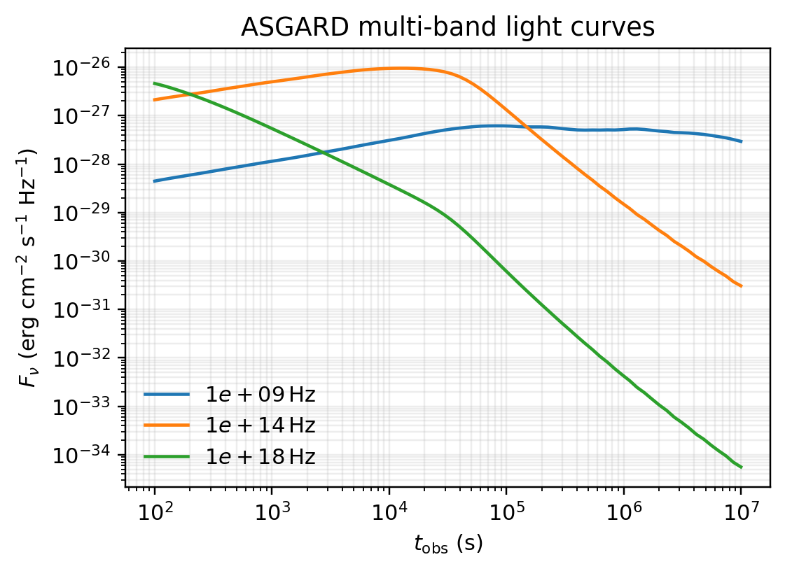
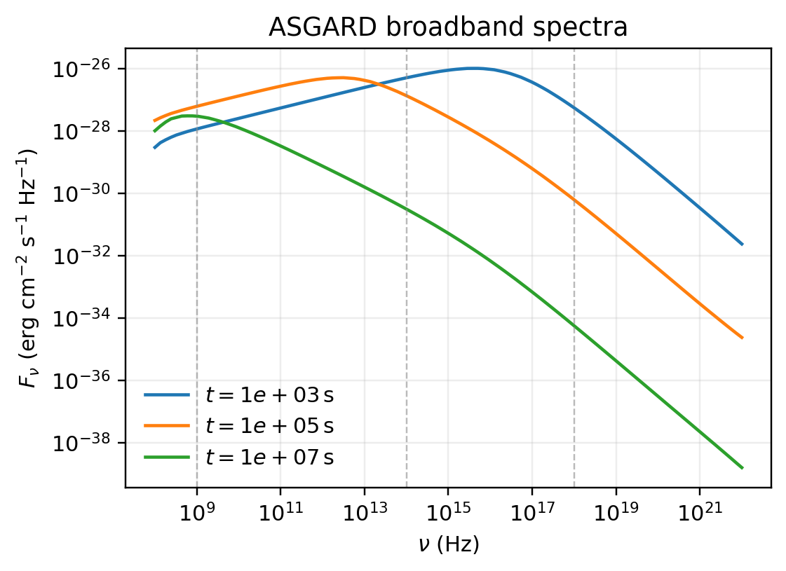

# 新手快速开始

本文给出从零运行 ASGARD 的最短路径。完整安装细节见 `doc/installation.md`，公开接口细节见 `doc/public_api.md`。

## 1. 构建默认数值核

当前开发环境固定为 WSL Ubuntu + `uv`。首次运行正向激波电子模型前，先构建默认 Fortran 扩展：

```bash
rtk bash -lc 'source ~/.wsl_env && cd "/mnt/c/Users/jia/Documents/New project/ASGARD_GRBAfterglow" && TMPDIR=/tmp uv run python build_extensions.py --module electron_forward_fullhide_1d --force'
```

只做文档或纯 Python 示例时不需要重复构建。若修改了 Fortran，按 `doc/validation_and_benchmarks.md` 跑受影响模块。

构建后先确认扩展能加载：

```python
from src.Electron.electron_radiation import electron_radiation_kernel
print("Fortran 扩展加载成功")
```

如果这里报 `ModuleNotFoundError` 或动态库加载错误，先回到构建命令，不要继续拟合。

## 2. 运行最小光变

```python
import numpy as np

from asgard_core import Hadronic, Model, Numerics, Observer, ObserverGrid, Radiation, ReverseShock, SolverOptions, UniformMedium, top_hat_jet

model = Model(
    jet=top_hat_jet(
        energy_iso_erg=1.0e52,
        initial_lorentz_factor=300.0,
        opening_angle_rad=0.1,
        shell_duration_s=None,
        magnetar=None,
        spreading=False,
    ),
    medium=UniformMedium(number_density_cm3=1.0),
    observer=Observer(z=0.1, viewing_angle_rad=0.0, viewing_azimuth_rad=0.0, luminosity_distance_cm=None),
    fwd_rad=Radiation(
        epsilon_e=0.1,
        epsilon_B=1.0e-3,
        p=2.3,
        proton_energy_fraction=0.0,
        epsilon_b_floor=None,
        magnetic_decay_alpha_t=0.0,
        magnetic_decay_t0_s=1.0,
        accelerated_electron_fraction=0.1,
        thermal_electrons=False,
        include_ssc=True,
        include_kn_correction=False,
        proton_synch=True,
        include_pgamma=False,
        bethe_heitler=False,
        hadronic_inverse_compton=False,
        pp=False,
        neutrino=False,
        acceleration_efficiency=1.0,
        reverse_proton_energy_fraction=0.0,
        pgamma_scheme="disabled",
        pair_production=False,
    ),
    numerics=Numerics(
        num_radius=120,
        num_theta=120,
        num_phi=1,
        num_observer_time=120,
        num_electron_gamma=121,
        num_photon_frequency=121,
        num_chi=None,
        num_threads=8,
        electron_adaptive_substeps=False,
        electron_substep_rtol=0.02,
        electron_substep_min=100,
        electron_substep_max=1000,
        initial_radius_cm=1.0e14,
    ),
    observer_grid=ObserverGrid(time_min_s=1.0e2, time_max_s=1.0e7),
    solver_options=SolverOptions(
        electron_solver="fullhide_1d",
        dynamics_solver="forward_legacy",
        geometry_projection="sed_legacy",
        electron_photon_coupling="separated",
        ssc_cooling_mode="nakar_y_thomson",
        synchrotron_integration="fixed_grid",
        cooling_kernel="legacy",
        radiation_kernel="legacy",
        structured_backend="fortran_1d",
        patch_sampling="uniform",
        patch_projection="auto",
        patch_sampling_pilot_theta=0,
        patch_sampling_num_times=12,
        patch_sampling_beaming_factor=3.0,
        patch_sampling_beaming_resolution=8.0,
        structured_parallel_mode="outer",
        structured_outer_threads=None,
        structured_inner_threads=None,
        fullhide2d_transport_model="legacy",
        fullhide2d_stochastic_accel_norm=0.0,
        fullhide2d_escape_mode="closed",
    ),
    reverse_shock=ReverseShock(enabled=False, shell_duration_s=10.0, upstream_sigma=0.0, include_cross_zone_ic=False, include_ssc=False),
    hadronic=Hadronic(enabled=False, solver="legacy_1d", num_proton_gamma=161, num_neutrino_frequency=121, pgamma_scheme="disabled", pair_cascade_iterations=1),
)

times = np.logspace(2, 7, 80)
freqs = np.array([1.0e9, 1.0e14, 1.0e18])
result = model.flux_density_grid(times, freqs)
print(result.total.shape)
```

上面 `SolverOptions` 的前 9 个字段控制普通 top-hat/ISM quickstart 路径；`patch_*`、`structured_*` 和 `fullhide2d_*` 字段服务结构化喷流或 2D 输运。quickstart 保留这些显式默认值，是为了让用户看到完整 API 关键字；每个字段的可选项和效果见 `doc/public_api.md`。

`result.total` 的形状是 `(num_frequency, num_time)`。常用分量：

- `result.fwd.sync`：正向激波同步辐射。
- `result.fwd.ssc`：正向激波同步自康普顿。
- `result.rev.sync`：反向激波同步辐射，未启用反向激波时为空或为零贡献。
- `result.cross_ic`：跨区逆康普顿，未启用时为 `None`。

对应输出图：



## 3. 单点、光谱和频段积分

观测数据常是逐点的 \((t_i,\nu_i)\)。这种情况下使用 `flux_density`：

```python
times = np.array([1.0e3, 3.0e4, 1.0e5])
freqs = np.array([1.0e14, 1.0e9, 1.0e18])
points = model.flux_density(times, freqs)
```

固定时刻光谱使用：

```python
nu = np.logspace(8, 25, 200)
sed = model.spectrum(1.0e4, nu)
```

对应谱图：



频段积分使用：

```python
band_flux = model.flux(
    time_s=1.0e4,
    nu_min_hz=1.0e14,
    nu_max_hz=1.0e18,
    num_points=96,
)
```

## 4. 单位

公开 API 使用 cgs 和观测者频率/时间：

| 量 | 单位 |
| --- | --- |
| 时间 | s |
| 频率 | Hz |
| 距离 | cm |
| 角度 | rad |
| 能量 | erg |

红移 \(z\) 通过 `Observer` 输入。如果没有显式给出 luminosity distance，运行时会由红移和宇宙学工具确定。

## 5. 结果是否可信

最基本的物理检查：

- 光变随时间应连续，除非存在明确的密度跳变、注入事件或 shock crossing。
- 若启用 `SolverOptions.nu_callback` 临时检查断频，\(\nu_m\)、\(\nu_c\)、\(\nu_a\) 应平滑演化；默认 `details()` 不保存这些数组。
- 平滑改变参数时，光变峰时和峰值不应出现孤立跳变。
- 反向激波的 `reverse_sigma -> 0` 必须回到非磁化基线。

若这些检查失败，应回到动力学、电子输运、辐射源项和观测投影查 bug，不做 smoothing 或经验修补。

## 6. 下一步

- 想知道每个 API 字段能选什么、选择后有什么效果，看 `doc/public_api.md`。
- 想从观测数据开始拟合，看 `doc/fitting_workflow.md`。
- 想比较 `emcee` 和 `pymultinest`，看 `doc/mcmc_fitting.md`。
